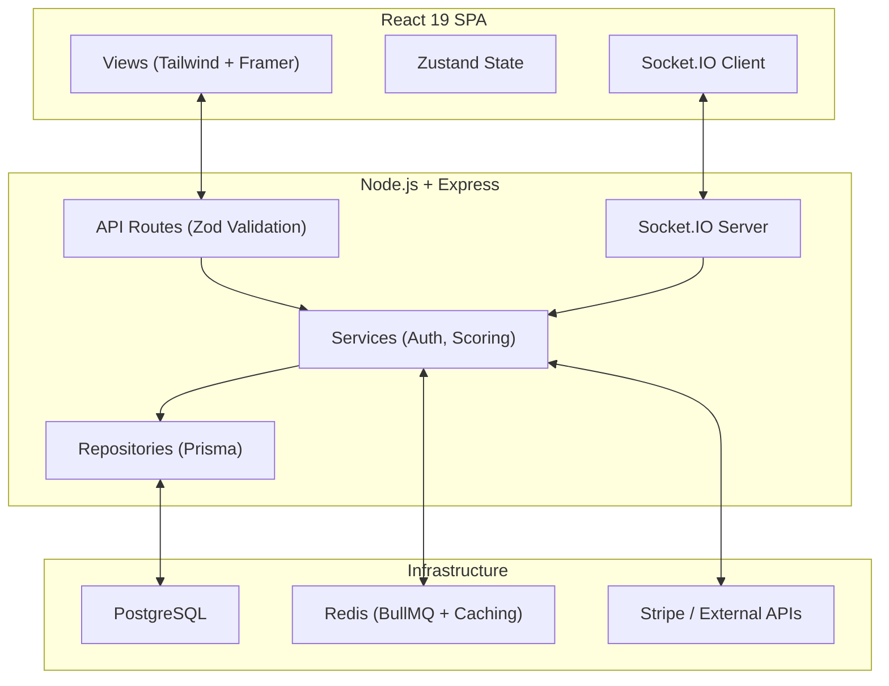

# MatchMind — Real-Time Fantasy Sports Draft Platform

> A real-time, football-first social prediction and live auction draft platform with WebSocket-powered bidding, fantasy points, and global leaderboards.

[](https://nodejs.org)
[](https://react.dev)
[](https://typescriptlang.org)
[](LICENSE)

---

## Table of Contents

- [1. Executive Summary](#1-executive-summary)
- [2. Tech Stack & Core Technologies](#2-tech-stack--core-technologies)
- [3. High-Level Architecture](#3-high-level-architecture)
- [4. Complete Folder Structure Tree](#4-complete-folder-structure-tree)
- [5. Exhaustive File-by-File & Folder-by-Folder Breakdown](#5-exhaustive-file-by-file--folder-by-folder-breakdown)
- [6. Data Models & Schemas](#6-data-models--schemas)
- [7. API Surface](#7-api-surface)
- [8. Configuration & Environment Variables](#8-configuration--environment-variables)
- [9. Build, Run & Deployment Instructions](#9-build-run--deployment-instructions)
- [10. Data & Control Flow Walkthroughs](#10-data--control-flow-walkthroughs)
- [11. Dependency Graph Summary](#11-dependency-graph-summary)
- [12. Testing Strategy](#12-testing-strategy)
- [13. Known Issues, Technical Debt & Assumptions](#13-known-issues-technical-debt--assumptions)
- [14. Glossary](#14-glossary)
- [15. Appendix](#15-appendix)

---

## 1. Executive Summary

**MatchMind** is a real-time fantasy sports draft platform built for football enthusiasts. It combines live-match experience with a Bloomberg-style trading terminal aesthetic. Users watch games, bid in live player auctions via WebSocket, chat in real-time, and compete on global leaderboards.

**Target users**: Fantasy sports enthusiasts, football fans, and competitive prediction communities.

**What problem it solves**: Traditional fantasy sports lack the excitement of live auctions and real-time social interaction. MatchMind provides a gamified, real-time drafting experience with anti-snipe mechanics, dynamic bid increments, and global competition.

**Why it exists**: To create an engaging, real-time fantasy sports platform that combines the thrill of live auctions with social features and competitive leaderboards.

_Note: The real-time WebSocket architecture, anti-snipe timer, and budget lockout mechanics are explicitly documented in the README and source code._

---

## 2. Tech Stack & Core Technologies

| Layer         | Technology     | Version | Purpose                       |
| ------------- | -------------- | ------- | ----------------------------- |
| Runtime       | Node.js        | 20+     | Backend runtime               |
| Language      | TypeScript     | 6       | Type-safe development         |
| API Framework | Express        | 5.2     | REST API                      |
| Realtime      | Socket.IO      | 4.8     | WebSocket communication       |
| ORM           | Prisma         | 5.22    | Database access               |
| Database      | PostgreSQL     | 16      | Primary data store            |
| Cache/Queue   | Redis          | 7       | Caching, queues, pub/sub      |
| Job Queue     | BullMQ         | 5.80    | Background job processing     |
| Frontend      | React          | 19      | SPA                           |
| Build Tool    | Vite           | 8.1     | Frontend bundling             |
| Styling       | Tailwind CSS   | 4.3     | Utility-first CSS             |
| State         | Zustand        | 5.0     | Client state management       |
| Auth          | JWT + Passport | —       | Authentication + Google OAuth |
| Payments      | Stripe         | 22.2    | Billing integration           |
| AI            | Anthropic SDK  | 0.104   | AI draft insights             |
| Monitoring    | Sentry         | 10.63   | Error tracking                |
| Metrics       | prom-client    | 15.1    | Prometheus metrics            |
| Testing       | Vitest         | 4.1     | Test framework                |
| E2E           | Playwright     | 1.61    | Browser testing               |
| CI/CD         | GitHub Actions | —       | Automated pipeline            |

---

## 3. High-Level Architecture



**Architectural Pattern**: **Modular Monolith** with Repository pattern, dependency injection via Awilix, and WebSocket server unified with the API. Real-time features share the same process as REST endpoints.

---

## 4. Complete Folder Structure Tree

```
Match-Mind/
├── .dockerignore
├── .editorconfig
├── .env.example
├── .gitattributes
├── .github/
│   ├── CODEOWNERS
│   ├── copilot-instructions.md
│   ├── dependabot.yml
│   ├── ISSUE_TEMPLATE/
│   ├── labeler.yml
│   ├── PULL_REQUEST_TEMPLATE.md
│   └── workflows/
│       ├── ci.yml
│       ├── codeql.yml
│       ├── deploy.yml
│       ├── gitleaks.yml
│       ├── labeler.yml
│       ├── maintenance.yml
│       ├── stale.yml
│       └── welcome.yml
├── .gitignore
├── .husky/
│   └── pre-commit
├── .prettierrc
├── .vscode/
│   └── settings.json
├── AGENTS.md
├── backend/
│   ├── .env.example
│   ├── Dockerfile
│   ├── Dockerfile.prod
│   ├── docs/
│   │   ├── REMEDIATION_STATUS.md
│   │   └── schema-baseline.md
│   ├── eslint.config.mjs
│   ├── instrument.ts
│   ├── package.json
│   ├── prisma/
│   │   └── schema.prisma          # Database schema
│   ├── prisma.config.ts
│   ├── scripts/                    # 14 utility scripts
│   ├── src/
│   │   ├── app.ts                  # Express app setup
│   │   ├── config/                 # Environment, schemas, OpenAPI
│   │   ├── container.ts            # Awilix DI container
│   │   ├── data/                   # 30+ JSON data files
│   │   ├── e2e/                    # End-to-end tests
│   │   ├── errors/                 # Domain errors
│   │   ├── index.ts                # Server entry point
│   │   ├── infrastructure/         # Database, health, shutdown
│   │   ├── lib/                    # Prisma, Redis, queue clients
│   │   ├── middleware/             # 12 middleware modules
│   │   ├── repositories/           # Data access layer
│   │   ├── routes/                 # 15 route modules
│   │   ├── server.ts               # HTTP server setup
│   │   ├── services/               # 20+ service modules
│   │   ├── socket/                 # WebSocket handlers
│   │   ├── test-utils/             # Test helpers
│   │   ├── utils/                  # Logger, AppError
│   │   └── workers/                # Background job workers
│   ├── tsconfig.json
│   └── vitest.config.js
├── docker-compose.override.yml.example
├── docker-compose.test.yml
├── docker-compose.yml
├── docs/
│   ├── community/
│   ├── decisions/
│   ├── design/
│   ├── product/
│   ├── project/
│   ├── reference/
│   └── technical/
├── frontend/
│   ├── .github/workflows/playwright.yml
│   ├── .gitignore
│   ├── .oxlintrc.json
│   ├── e2e/                        # Playwright E2E tests
│   ├── index.html
│   ├── package.json
│   ├── playwright.config.ts
│   ├── README.md
│   ├── src/
│   │   ├── App.css
│   │   ├── App.tsx
│   │   ├── components/             # Reusable UI components
│   │   ├── config/env.ts
│   │   ├── hooks/                  # Custom React hooks
│   │   ├── index.css
│   │   ├── lib/utils.ts
│   │   ├── main.tsx
│   │   ├── store/                  # Zustand stores
│   │   └── views/                  # Page views
│   ├── tsconfig*.json
│   └── vite.config.ts
├── k8s/
│   └── deployment.yaml             # Kubernetes deployment
├── LICENSE
├── Makefile
├── package.json                    # Root monorepo config
├── packages/
│   └── shared-types/               # Shared TypeScript types
├── PROJECT_ANALYSIS.md
├── PROJECT_OVERVIEW.md             # This file
└── README.md
```

---

## 5. Exhaustive File-by-File & Folder-by-Folder Breakdown

### Backend Core

#### `backend/src/app.ts`

- **Purpose**: Express application setup with middleware chain: request ID → compression → CORS → Helmet (CSP) → HTTPS redirect → rate limiting → pino-http → JSON parsing → cookie parsing → Passport → CSRF → routes → metrics → error handler.
- **Key feature**: Verifies all JWT secrets are distinct at startup — fails fast if identical.

#### `backend/src/container.ts`

- **Purpose**: Awilix dependency injection container. Registers all services, repositories, and middleware for constructor injection.

#### `backend/src/server.ts`

- **Purpose**: HTTP server creation with Socket.IO attachment.

### Backend Routes (15 modules)

| Route            | Purpose                              |
| ---------------- | ------------------------------------ |
| `auth.ts`        | Login, signup, OAuth, password reset |
| `tournaments.ts` | Tournament CRUD                      |
| `players.ts`     | Player pool management               |
| `rooms.ts`       | Draft room creation/management       |
| `auction.ts`     | Live auction bidding                 |
| `draft.ts`       | Draft mechanics                      |
| `franchises.ts`  | Team/franchise management            |
| `fixtures.ts`    | Match fixtures                       |
| `leaderboard.ts` | Global rankings                      |
| `users.ts`       | User profile management              |
| `messages.ts`    | Chat messaging                       |
| `search.ts`      | Global search                        |
| `admin.ts`       | Admin operations                     |
| `stripe.ts`      | Payment integration                  |
| `ai.ts`          | AI draft insights                    |

### Backend Services (20+ modules)

Key services: `authService`, `auctionEngine`, `draftRunService`, `fantasyPoints`, `scoring`, `leaderboardService`, `matchService`, `roomService`, `userService`, `cacheService`, `emailService`, `stripeService`, `sportRadar`, `tokenService`, `lockService`, `messageService`, `draftTicketService`, `draftAppService`, `adminService`

### Backend Middleware (12 modules)

| Middleware          | Purpose                                              |
| ------------------- | ---------------------------------------------------- |
| `auth.ts`           | JWT verification                                     |
| `rateLimiter.ts`    | Rate limiting (global, auth, password reset, public) |
| `csrf.ts`           | Double-submit cookie CSRF protection                 |
| `validate.ts`       | Zod request validation                               |
| `asyncHandler.ts`   | Async error wrapper                                  |
| `errorHandler.ts`   | Global error handling                                |
| `requestId.ts`      | Unique request ID generation                         |
| `metrics.ts`        | Prometheus metrics                                   |
| `circuitBreaker.ts` | Circuit breaker pattern                              |
| `idempotency.ts`    | Idempotent request handling                          |
| `draftGate.ts`      | Draft permission gating                              |
| `requireAdmin.ts`   | Admin role guard                                     |

### Backend Data (30+ JSON files)

Pre-seeded data files for players, teams, tournaments, formations, venues, achievements, and more.

---

## 6. Data Models & Schemas

### Prisma Schema (Key Entities)

- **User**: id, email, name, password, role, avatar, stripeCustomerId
- **Tournament**: id, name, status, startDate, endDate
- **Player**: id, name, position, team, rating, photo, rarity
- **Room**: id, name, tournamentId, hostId, status, maxPlayers
- **DraftSession**: id, roomId, status, currentPick, timeRemaining
- **DraftPick**: id, sessionId, playerId, managerId, amount, pickOrder
- **AuctionState**: id, roomId, currentBid, currentBidder, timeRemaining
- **Team**: id, name, roomId, userId, budget, players
- **Leaderboard**: id, userId, points, rank
- **Message**: id, roomId, userId, content, timestamp

---

## 7. API Surface

### REST API (`/api/v1/`)

45+ endpoints across 15 route modules. Key endpoints:

| Method | Path                            | Purpose             |
| ------ | ------------------------------- | ------------------- |
| POST   | `/api/v1/auth/login`            | User login          |
| POST   | `/api/v1/auth/signup`           | User registration   |
| GET    | `/api/v1/rooms`                 | List draft rooms    |
| POST   | `/api/v1/rooms`                 | Create draft room   |
| POST   | `/api/v1/rooms/:id/auction/bid` | Place auction bid   |
| GET    | `/api/v1/leaderboard`           | Global leaderboard  |
| GET    | `/api/v1/players`               | Player pool         |
| POST   | `/api/v1/draft/start`           | Start draft session |
| GET    | `/api/metrics`                  | Prometheus metrics  |

### WebSocket Events

| Event                | Direction       | Purpose      |
| -------------------- | --------------- | ------------ |
| `auction:bid`        | Client → Server | Place bid    |
| `auction:update`     | Server → Client | Bid update   |
| `draft:pick`         | Bidirectional   | Draft pick   |
| `chat:message`       | Bidirectional   | Chat message |
| `leaderboard:update` | Server → Client | Rank update  |

---

## 8. Configuration & Environment Variables

| Variable             | Purpose                          | Required |
| -------------------- | -------------------------------- | -------- |
| `DATABASE_URL`       | PostgreSQL connection            | **Yes**  |
| `REDIS_URL`          | Redis connection                 | **Yes**  |
| `JWT_SECRET`         | JWT signing key (min 32 chars)   | **Yes**  |
| `JWT_REFRESH_SECRET` | Refresh token secret (distinct)  | **Yes**  |
| `JWT_RESET_SECRET`   | Password reset secret (distinct) | **Yes**  |
| `FRONTEND_URL`       | Frontend URL for CORS            | No       |
| `STRIPE_SECRET_KEY`  | Stripe API key                   | No       |
| `ANTHROPIC_API_KEY`  | Claude API key for AI features   | No       |

---

## 9. Build, Run & Deployment Instructions

### Quick Start

```bash
# Install dependencies
npm install

# Setup database
npx prisma db push

# Seed data
npx tsx scripts/seedDraftPlayers.ts

# Start development
npm run dev
```

### Docker

```bash
docker-compose up -d
# PostgreSQL: localhost:5432
# Redis: localhost:6379
# API: localhost:3001
```

### Testing

```bash
npm run test        # Vitest
npm run test:ci     # CI mode
npm run lint        # ESLint
npm run typecheck   # TypeScript check
```

---

## 10. Data & Control Flow Walkthroughs

### Flow 1: Live Auction Bid

1. Manager clicks "Bid" in auction room
2. Frontend sends `auction:bid` via WebSocket
3. `auctionEngine.ts` validates: budget check, increment check, anti-snipe timer
4. Redis distributed lock prevents race conditions
5. Updated auction state broadcast to all room members
6. If bid in final seconds: timer resets (anti-snipe)

### Flow 2: Draft Pick

1. Draft session advances to next pick
2. `draftRunService.ts` manages pick order
3. Manager selects player from pool
4. `fantasyPoints.ts` assigns initial points
5. Room standings updated
6. Global leaderboard recalculated

---

## 11. Dependency Graph Summary

```
frontend/src/* → backend/src/routes/* (HTTP/WebSocket)
backend/src/routes/* → backend/src/services/*
backend/src/services/* → backend/src/repositories/*
backend/src/repositories/* → Prisma → PostgreSQL
backend/src/services/* → Redis (cache, locks, pub/sub)
backend/src/workers/* → BullMQ → Redis
```

---

## 12. Testing Strategy

- **Unit/Integration**: Vitest with 194 passing tests
- **E2E**: Playwright (auth.spec.ts, draft.spec.ts)
- **CI**: Lint → Typecheck → Test → Gitleaks → Audit
- **Lighthouse**: 98 Performance / 100 Accessibility

---

## 13. Known Issues, Technical Debt & Assumptions

### Known Issues

1. **JSON → PostgreSQL migration**: Proxy layer mimics PrismaClient for seamless transition.
2. **WebSocket scaling**: Single-instance only; needs `socket.io-redis-adapter` for horizontal scaling.

### Technical Debt

1. **30+ JSON data files**: Should be migrated to database seed scripts.
2. **No read replicas**: All queries hit primary database.

### Assumptions

1. **Football-first**: Currently designed for football; other sports require schema changes.
2. **Single-region deployment**: No multi-region support.

---

## 14. Glossary

| Term                   | Definition                                                    |
| ---------------------- | ------------------------------------------------------------- |
| **Anti-Snipe Timer**   | Bids in final seconds reset the countdown                     |
| **Dynamic Increments** | Required bid amount scales with current price                 |
| **Budget Lockout**     | Bids preventing affordable remaining roster slots are blocked |
| **Blind Nominations**  | Players are algorithmically nominated, not user-selected      |
| **Salary Cap**         | $100M budget per manager                                      |
| **Roster Slots**       | Mandatory 15-man squad (2 GK, 5 DEF, 5 MID, 3 FWD)            |

---

## 15. Appendix

### Engineering Audit

The project underwent a multi-volume engineering audit (OWASP Top 10, API design, testing, performance, architecture). Initial score: 4.8/10. After two remediation cycles: **6.2/10**.

### Metrics

- 194 passing tests (Vitest)
- 45+ API endpoints
- 100% TypeScript (Strict Mode)
- Lighthouse: 98 Performance / 100 Accessibility

---

_This document was generated as part of a comprehensive project documentation effort. Last updated: August 8, 2026._
