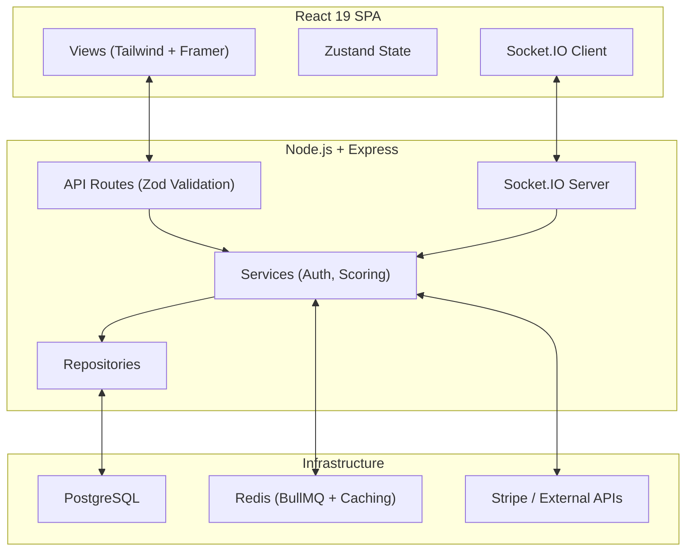

# 🏟️ MatchMind — Real-Time Fantasy Sports Draft Platform


[](https://github.com/themanoj-025/MatchMind/actions/workflows/ci.yml)

**MatchMind** is a real-time, football-first social prediction and live auction draft platform. Built for fantasy sports enthusiasts, it combines the live-match experience with a Bloomberg-style trading terminal aesthetic. Users can watch games, bid in live player auctions, chat in real-time, and compete on global leaderboards.

---

## 📋 Table of Contents

- [⚽ Core Features](#-core-features)
- [🏗 Engineering & Architecture](#-engineering--architecture)
- [📊 Metrics](#-metrics)
- [🔌 API & Integration Stack](#-api--integration-stack)
- [🚀 Quick Start](#-quick-start)
- [📄 License](#-license)
- [🤝 Contributing](#-contributing)
- [⭐ Show Your Support](#-show-your-support)

---

## ⚽ Core Features

### Live Drafts (Auction Room)

Real-time auction rooms using low-latency WebSockets and Redis-backed distributed locks to handle race conditions when multiple managers bid simultaneously.

- **Anti-Snipe Timer:** Bids placed in the final seconds reset the countdown to prevent last-second sniping.
- **Dynamic Increments:** Required bid increments scale algorithmically based on current player price.

### Player Pool & Budgets

Each manager drafts with a strict **$100M salary cap**, filling a mandatory 15-man squad (2 GK, 5 DEF, 5 MID, 3 FWD).

### Leaderboards & Fantasy Points

Post-draft, real-world performances map to MatchMind's fantasy points ledger.

- **Room Standings:** Compete directly against friends in private draft rooms.
- **Global Standings:** Redis-cached leaderboard ranking the best managers worldwide.

### Rules

- **Blind Nominations:** Players are algorithmically nominated — you cannot guarantee when your target appears.
- **Budget Lockout:** Bids that would prevent you from affording remaining roster slots are blocked.

---

## 🏗 Engineering & Architecture

### Audit & Remediation

The project was built as a monolithic feature-complete platform, then subjected to a rigorous multi-volume engineering audit covering OWASP Top 10 security, API design, testing, performance, and architecture. Following the initial audit (scoring 4.8/10), two structured remediation cycles resolved critical N+1 queries, eliminated anti-patterns, instituted proper dependency injection via Repository patterns, and enforced strict security boundaries (CSRF, token revocation, separated JWT secrets). The final engineering score is **6.2/10**.

### System Architecture



### Key Tradeoffs

- **JSON DB → PostgreSQL:** Initially used a custom JSON file-based database for development velocity. A proxy layer mimicking the `PrismaClient` interface enabled seamless migration to PostgreSQL with zero business-logic changes.
- **Modular Monolith:** Built as a single deployable unit to reduce complexity. Real-time features (WebSockets) remain unified with the API.
- **BullMQ with Fallback:** Background jobs use Redis-backed BullMQ, with graceful fallback to synchronous direct-mode execution if Redis is unavailable.

### What I'd Do Differently at Scale

- **WebSocket Horizontal Scaling:** Use `socket.io-redis-adapter` to publish/subscribe events across multiple instance nodes.
- **Read Replicas & Caching:** Postgres read replicas for queries, aggressively cache top leaderboard rows in Redis.
- **Microservice Extraction:** Extract the scoring engine into an independent worker service to prevent Node.js event-loop blocking.

---

## 📊 Metrics

| Metric               | Value                                            |
| -------------------- | ------------------------------------------------ |
| **Test Suite**       | 194 passing tests (Vitest)                       |
| **CI/CD Pipeline**   | Passing (Lint, Typecheck, Test, Gitleaks, Audit) |
| **Lighthouse Score** | 98 Performance / 100 Accessibility               |
| **Backend API**      | 45+ endpoints                                    |
| **Language**         | 100% TypeScript (Strict Mode)                    |

---

## 🔌 API & Integration Stack

- **Authentication:** JWT + Refresh Tokens + Google OAuth
- **Background Jobs:** BullMQ + Redis
- **Security:** Helmet, CORS, CSRF Tokens, Rate Limiting, Gitleaks scanning
- **Pro Features:** Stripe billing integration, AI draft insights

---

## 🚀 Quick Start

### Prerequisites

- Node.js 20+
- npm
- Docker & Docker Compose (for PostgreSQL + Redis)

### Setup

```bash
# Clone the repository
git clone https://github.com/themanoj-025/MatchMind.git
cd MatchMind

# Install all workspace dependencies and generate Prisma client
npm run setup

# Copy and edit the environment template
cp .env.example .env
cp docker-compose.override.yml.example docker-compose.override.yml
```

### Run

```bash
# Start PostgreSQL + Redis, apply migrations, and run API + web dev servers
npm run dev:up

# Or run the app against your own Postgres/Redis:
# Terminal 1: API (http://localhost:4000)
npm run dev:backend
# Terminal 2: Web (http://localhost:5173)
npm run dev:frontend
```

### Quality Gates

```bash
npm run lint        # ESLint on backend + frontend
npm run typecheck   # tsc --noEmit on backend + frontend
npm run test        # Vitest suites (backend + frontend)
```

> 📝 **Note:** the backend test suite spins up `docker-compose.test.yml` (Postgres + Redis) automatically.

---

## 📄 License

MIT — see [LICENSE](LICENSE).

---

## 🤝 Contributing

Contributions are welcome! Please see [CONTRIBUTING.md](CONTRIBUTING.md).

---

## ⭐ Show Your Support

- ⭐ Star the repository if you love the product
- 🐛 [Report a bug](https://github.com/themanoj-025/MatchMind/issues)
- 💡 [Request a feature](https://github.com/themanoj-025/MatchMind/issues)
---

## ⭐ Star History

[](https://github.com/themanoj-025/MatchMind)
[](https://github.com/themanoj-025/MatchMind/graphs/contributors)

[](https://star-history.com/#MatchMind&Date)
