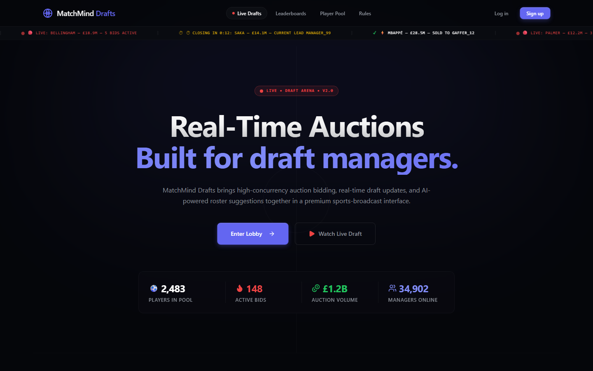
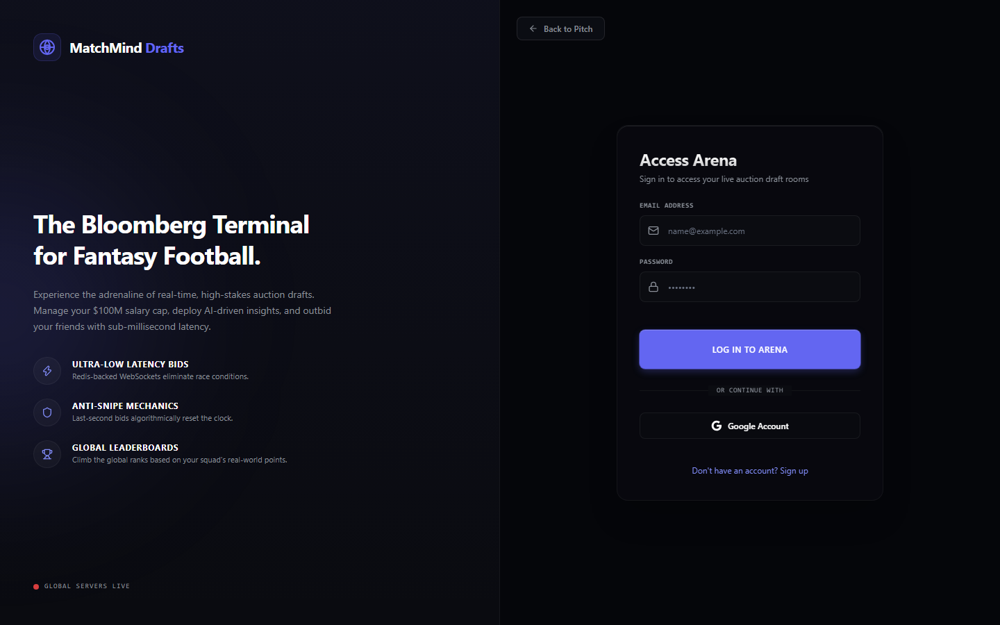
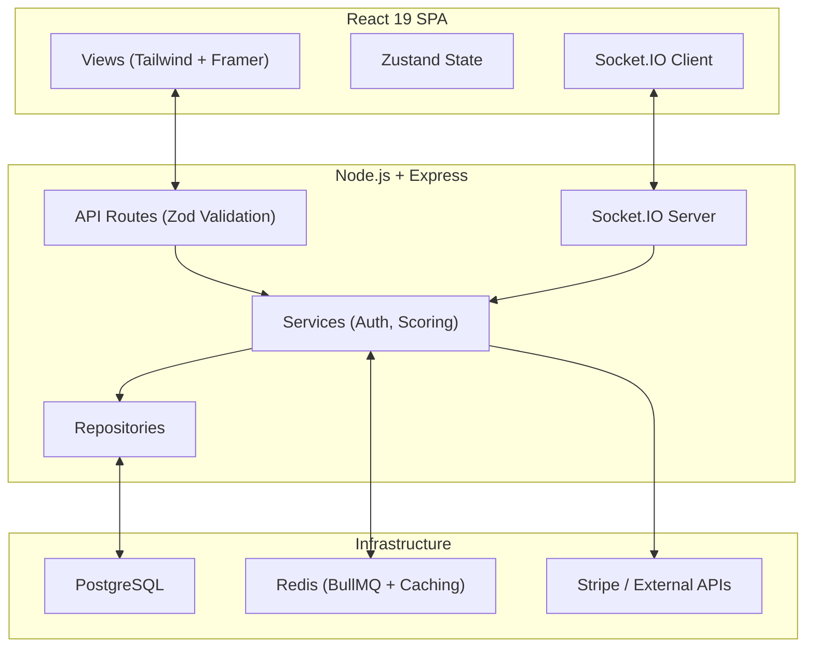

# 🏟️ MatchMind — Real-Time Fantasy Sports Draft Platform

<p align="center">
  
  
  
  
  <a href="https://github.com/themanoj-025/MatchMind/actions/workflows/ci.yml?branch=main"></a>
</p>

<h1 align="center">🏟️ MatchMind</h1>

<p align="center">
  <strong>Real-time, football-first social prediction and live auction draft platform.</strong> Built for fantasy sports enthusiasts, it combines the live-match experience with a Bloomberg-style trading terminal aesthetic. Users can watch games, bid in live player auctions, chat in real-time, and compete on global leaderboards.
</p>

---

## 💡 Why I built this

I built MatchMind because existing fantasy sports platforms felt too static. I wanted to build a real-time system that felt like a fast-paced trading terminal, which gave me the perfect excuse to dive deep into WebSockets, Redis pub/sub, and managing complex distributed state.

## ⚠️ Known limitations

- **WebSocket horizontal scaling:** ✅ Implemented via `@socket.io/redis-adapter` — rooms/broadcasts span all backend replicas through the shared Redis. Ops requirements: every replica must point `REDIS_URL` at the same Redis (already true — it backs BullMQ, rate limiting, and idempotency), and HTTP long-polling clients need session stickiness. The frontend pins `transports: ['websocket']`, which is sticky-free. When Redis is unavailable at boot, the server falls back to the single-node memory adapter and logs the reason.
- **Race-condition load testing:** While Redis-backed locks are in place for the auction room, we lack an automated artillery/k6 load test to mathematically prove high-throughput concurrency safety under extreme load.
- **Scoring engine blocking:** The scoring engine runs in the main Node.js event loop, which could block real-time WebSocket events if the player pool grows too large.

---

## 📸 Screenshots

|                                                 |                                             |
| ----------------------------------------------- | ------------------------------------------- |
|  |  |
| _Landing page with live draft ticker_           | _Login / signup_                            |

> To add more: run the backend and frontend (`npm run dev` in each), open a draft room, capture your screen, save images to `docs/assets/screenshots/`, and reference them below.
>
> **Suggested additional screenshots:**
>
> - Live auction room with the anti-snipe timer running
> - Squad view showing the 15-man roster under the $100M cap
> - Global leaderboard

---

## 📋 Table of Contents

- [⚽ Core features](#-core-features)
- [🏗 Engineering & architecture](#-engineering--architecture)
- [📊 Metrics](#-metrics)
- [🔌 API & integration stack](#-api--integration-stack)
- [🚀 Quick start](#-quick-start)
- [🔌 REST API](#-rest-api)
- [🔐 WebSockets](#-websockets)
- [🔧 Environment variables](#-environment-variables)
- [🧪 Testing](#-testing)
- [🚀 Deployment](#-deployment)
- [🗺️ Roadmap](#️-roadmap)
- [🤝 Contributing](#-contributing)
- [⭐ Show your support](#-show-your-support)
- [License](#license)

---

## ⚽ Core features

### Live drafts (auction room)

Real-time auction rooms using WebSockets and Redis-backed locks to manage concurrent bids. (Note: true high-throughput concurrency safety has not yet been benchmarked with automated load tests).

- **Anti-snipe timer:** Bids placed in the final seconds reset the countdown to prevent last-second sniping
- **Dynamic increments:** Required bid increments scale algorithmically based on current player price

### Player pool & budgets

Each manager drafts with a strict **$100M salary cap**, filling a mandatory 15-man squad (2 GK, 5 DEF, 5 MID, 3 FWD).

### Leaderboards & fantasy points

Post-draft, real-world performances map to MatchMind's fantasy points ledger.

- **Room standings:** Compete directly against friends in private draft rooms
- **Global standings:** Redis-cached leaderboard ranking the best managers worldwide

### Rules

- **Blind nominations:** Players are algorithmically nominated — you cannot guarantee when your target appears
- **Budget lockout:** Bids that would prevent you from affording remaining roster slots are blocked

## 🏗 Engineering & architecture

### Audit & remediation

The project was built as a monolithic feature-complete platform, then subjected to a rigorous multi-volume engineering audit covering OWASP Top 10 security, API design, testing, performance, and architecture. Following the initial audit (scoring 4.8/10), two structured remediation cycles resolved critical N+1 queries, eliminated anti-patterns, instituted proper dependency injection via Repository patterns, and enforced strict security boundaries (CSRF, token revocation, separated JWT secrets). The final engineering score is **6.2/10**.

### System architecture


```mermaid
graph TB
    subgraph Frontend["React 19 SPA"]
        F1["Views (Tailwind + Framer)"]
        F2["Zustand State"]
        F3["Socket.IO Client"]
    end

    subgraph Backend["Node.js + Express"]
        B1["API Routes (Zod Validation)"]
        B2["Services (Auth, Scoring)"]
        B3["Repositories"]
        B4["Socket.IO Server"]
    end

    subgraph Infrastructure
        I1["PostgreSQL"]
        I2["Redis (BullMQ + Caching)"]
        I3["Stripe / External APIs"]
    end

    F1 <--> B1
    F3 <--> B4
    B1 --> B2
    B2 --> B3
    B4 --> B2
    B3 <--> I1
    B2 <--> I2
    B2 --> I3
```

### Key tradeoffs

- **JSON DB → PostgreSQL:** Initially used a custom JSON file-based database for development velocity. A proxy layer mimicking the `PrismaClient` interface enabled seamless migration to PostgreSQL with zero business-logic changes.
- **Modular monolith:** Built as a single deployable unit to reduce complexity. Real-time features (WebSockets) remain unified with the API.
- **BullMQ with fallback:** Background jobs use Redis-backed BullMQ, with graceful fallback to synchronous direct-mode execution if Redis is unavailable.

### What I'd do differently at scale

- **WebSocket horizontal scaling:** Done — `@socket.io/redis-adapter` attached at boot (`backend/src/lib/socketAdapter.ts`), with graceful fallback to the memory adapter. Cross-node delivery is covered by an integration test (`socketAdapter.test.ts`). Remaining: an automated artillery/k6 run to prove high-throughput concurrency under extreme load.
- **Read replicas & caching:** Postgres read replicas for queries, aggressively cache top leaderboard rows in Redis.
- **Microservice extraction:** Extract the scoring engine into an independent worker service to prevent Node.js event-loop blocking.

## 📊 Metrics

| Metric               | Value                                            |
| -------------------- | ------------------------------------------------ |
| **Test suite**       | 194 passing tests (Vitest)                       |
| **CI/CD pipeline**   | Passing (lint, typecheck, test, gitleaks, audit) |
| **Lighthouse score** | 98 Performance / 100 Accessibility               |
| **Backend API**      | 45+ endpoints                                    |
| **Language**         | 100% TypeScript (strict mode)                    |

## 🔌 API & integration stack

- **Authentication:** JWT + refresh tokens + Google OAuth
- **Background jobs:** BullMQ + Redis
- **Security:** Helmet, CORS, CSRF tokens, rate limiting, Gitleaks scanning
- **Pro features:** Stripe billing integration, AI draft insights

## 🚀 Quick start

### Prerequisites

- Node.js 20+
- npm
- Docker & Docker Compose (for PostgreSQL + Redis)

### Setup

```bash
# 1. Clone the repository
git clone https://github.com/themanoj-025/MatchMind.git
cd MatchMind

# 2. Install all workspace dependencies and generate Prisma client
npm run setup

# 3. Copy and edit the environment template
cp .env.example .env
cp docker-compose.override.yml.example docker-compose.override.yml
```

### Run

```bash
# 1. Start PostgreSQL + Redis, apply migrations, and run API + web dev servers
npm run dev:up

# 2. Or run the app against your own Postgres/Redis:
#    Terminal 1: API (http://localhost:4000)
npm run dev:backend
#    Terminal 2: Web (http://localhost:5173)
npm run dev:frontend
```

### Quality gates

```bash
npm run lint       # ESLint on backend + frontend
npm run typecheck  # tsc --noEmit on backend + frontend
npm run test       # Vitest suites (backend + frontend)
```

> 📝 **Note:** the backend test suite spins up `docker-compose.test.yml` (Postgres + Redis) automatically.

## 🔌 REST API

### Key endpoints

| Method  | Endpoint                        | Description               | Auth |
| ------- | ------------------------------- | ------------------------- | ---- |
| `POST`  | `/api/v1/auth/register`         | Register new user         | No   |
| `POST`  | `/api/v1/auth/login`            | Login (returns JWT)       | No   |
| `GET`   | `/api/v1/users/me`              | Get current user profile  | Yes  |
| `PATCH` | `/api/v1/users/me`              | Update profile            | Yes  |
| `POST`  | `/api/v1/rooms`                 | Create draft room         | Yes  |
| `POST`  | `/api/v1/rooms/:id/join`        | Join room via invite code | Yes  |
| `POST`  | `/api/v1/rooms/:id/ready`       | Toggle ready status       | Yes  |
| `GET`   | `/api/v1/matches`               | List fixtures             | Yes  |
| `GET`   | `/api/v1/leaderboard/rooms/:id` | Room leaderboard          | Yes  |
| `POST`  | `/api/v1/stripe/checkout`       | Pro subscription checkout | Yes  |

### Authentication

JWT-based with refresh tokens. Set `JWT_SECRET` and `JWT_REFRESH_SECRET` in `.env`.

```bash
# Register
curl -X POST http://localhost:4000/api/v1/auth/register \
  -H "Content-Type: application/json" \
  -d '{"username":"user","email":"user@example.com","password":"pass"}'

# Login
curl -X POST http://localhost:4000/api/v1/auth/login \
  -H "Content-Type: application/json" \
  -d '{"email":"user@example.com","password":"pass"}'
```

## 🔐 WebSockets

Real-time auction and chat via Socket.IO:

| Event                | Direction     | Description                                    |
| -------------------- | ------------- | ---------------------------------------------- |
| `bid`                | Client→Server | Place a bid on current player                  |
| `chat:send`          | Client→Server | Send chat message                              |
| `chat:message`       | Server→Client | Broadcast chat message                         |
| `auction:update`     | Server→Client | Auction state change (new player, sold, timer) |
| `room:member_update` | Server→Client | Member join/leave/ready                        |
| `leaderboard:update` | Server→Client | Score update after fixture finalization        |

## 🔧 Environment variables

| Variable             | Default                  | Description                    |
| -------------------- | ------------------------ | ------------------------------ |
| `DATABASE_URL`       | `postgresql://...`       | PostgreSQL connection string   |
| `REDIS_URL`          | `redis://localhost:6379` | Redis connection string        |
| `JWT_SECRET`         | (required)               | JWT signing secret (64+ chars) |
| `JWT_REFRESH_SECRET` | (required)               | Refresh token secret           |
| `STRIPE_SECRET_KEY`  | (optional)               | Stripe billing key             |
| `ANTHROPIC_API_KEY`  | (optional)               | AI draft insights              |

## 🧪 Testing

```bash
# 1. Run all tests
npm run test

# 2. Run a specific test file
npx vitest run src/services/auctionEngine.test.ts

# 3. Run with coverage
npx vitest run --coverage
```

> [!NOTE] The README previously claimed a coverage number without a reproducible command or CI gate to back it up, so it was removed in favor of the reproducible `npm run test -- --coverage` command above.

## 🚀 Deployment

### Docker Compose

```bash
# 1. Start all services
npm run dev:up

# 2. Production build
npm run build
cd backend && npm start
```

### Kubernetes

Helm charts and manifests are in `k8s/`.

## 🗺️ Roadmap

> [!CAUTION] Checked items are built and verified. Unchecked items are tracked in the issue tracker.

- [x] Real-time WebSocket auction rooms
- [x] Redis-backed locks for concurrent bids
- [x] Anti-snipe timer + dynamic increments
- [x] $100M salary cap + 15-man squad
- [x] Room + global leaderboards
- [x] JWT + refresh token + Google OAuth
- [x] Stripe billing integration (pro)
- [ ] Automated artillery/k6 load test (tracked public issue)

## 🤝 Contributing

Contributions are welcome! Please see [CONTRIBUTING.md](CONTRIBUTING.md).

## ⭐ Show your support

- ⭐ Star the repository if you love the product
- 🐛 [Report a bug](https://github.com/themanoj-025/MatchMind/issues)
- 💡 [Request a feature](https://github.com/themanoj-025/MatchMind/issues)

## License

MIT — see [LICENSE](LICENSE).
