# MatchMind — Architecture

> Textual architecture of the MatchMind fantasy sports platform (as-is; no behavior changes).

## System Overview

MatchMind is a TypeScript monorepo with three packages:

1. **Backend** (`backend/`) — Express + Prisma + PostgreSQL + Redis, with WebSocket support for real-time auction/room features.
2. **Frontend** (`frontend/`) — React + Vite SPA with Playwright e2e tests.
3. **Shared Types** (`packages/shared-types/`) — Cross-package type definitions.

```mermaid
graph TD
    subgraph WEB[Frontend React/Vite]
        APP[App.tsx]
        VIEWS[views: Auth, Lobby, DraftRoom, Leaderboard, Landing]
        STORE[store: useAuthStore, useToastStore]
        HOOKS[hooks: useAuctionAdvice, useLeaderboard]
    end

    subgraph API[Backend Express]
        SERVER[server.ts]
        ROUTES[routes: auth, auction, draft, rooms, users, players, matches, tournaments...]
        MIDDLEWARE[middleware: auth, rateLimiter, csrf, errorHandler, idempotency...]
        SOCKET[socket/]
        WORKERS[workers: auctionWorker]
    end

    subgraph BIZ[Backend Services]
        SVC[services: auth, auction, draft, fantasyPoints, scoring, room, match, leaderboard...]
        REPO[repositories/]
        ENGINE[auctionEngine, draftRunService]
    end

    subgraph INFRA
        PG[(PostgreSQL via Prisma)]
        REDIS[(Redis)]
    end

    WEB --> API
    API --> MIDDLEWARE
    API --> SVC
    SVC --> REPO
    SVC --> ENGINE
    SOCKET --> SVC
    WORKERS --> SVC
    REPO --> PG
    SVC --> REDIS
```

## Key Features

- **Auction engine** — real-time bidding via WebSockets with circuit breaker, rate limiting, and idempotency.
- **Draft system** — snake-style player draft with tickets, runs, and eligibility validation.
- **Fantasy scoring** — points calculation, leaderboard mapping, timeframe-based (overall/weekly/monthly).
- **Rooms** — private room/lobby management with WebSocket lifecycle.
- **Stripe integration** — payments/subscriptions.

## Deployment

- Docker Compose (`docker-compose.yml`) + Kubernetes (`k8s/deployment.yaml`).
- PostgreSQL via Prisma ORM + Redis for queues/sessions.
- CI: eslint, typecheck, vitest, Playwright; CodeQL + gitleaks for security.
