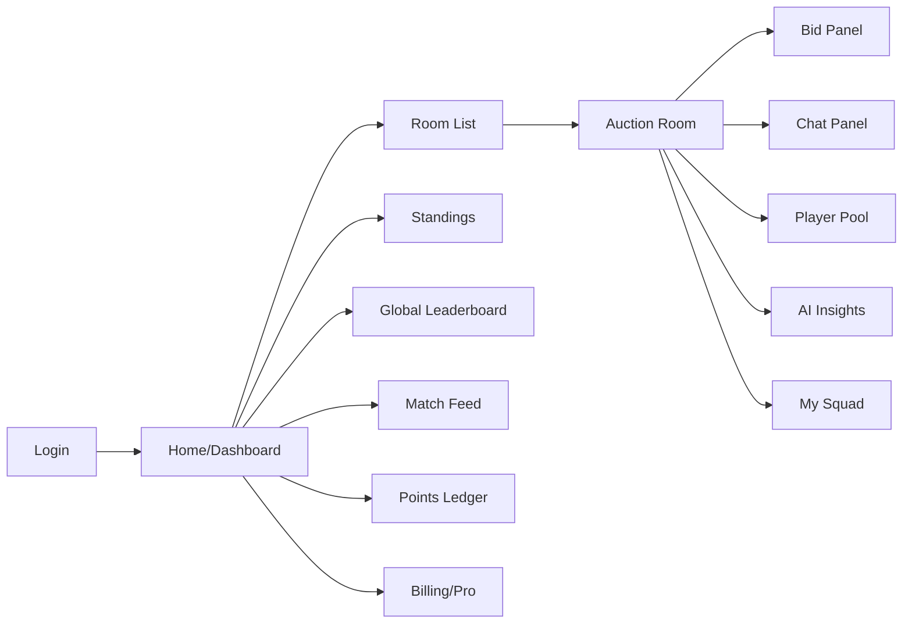
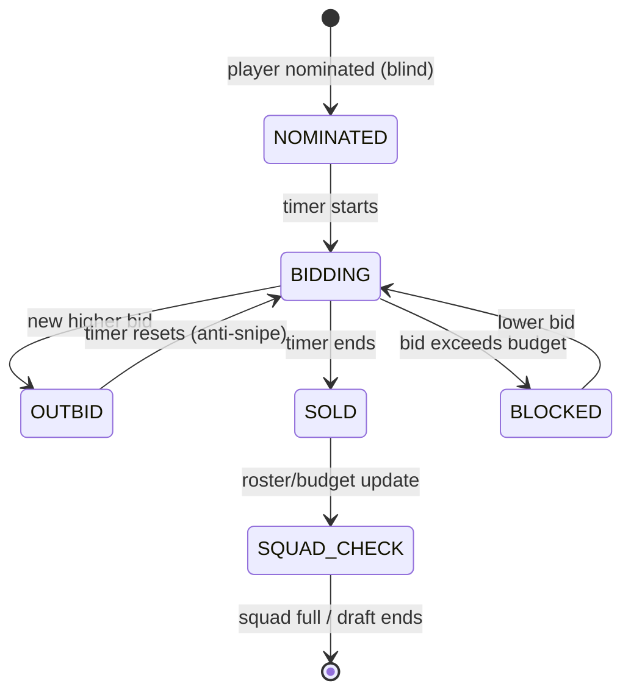
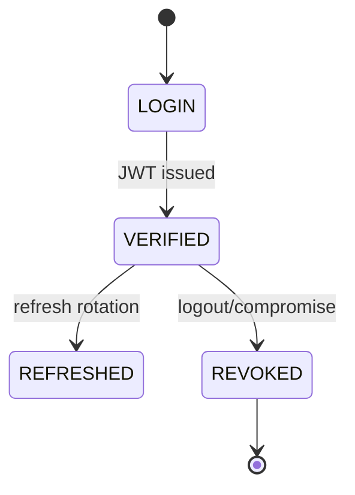

# AppFlow — MatchMind: Application Flow

| Field        | Value      |
| ------------ | ---------- |
| Version      | v0.1       |
| Last Updated | 2026-08-06 |
| Owner        | PM / QA    |
| Status       | In Review  |

---

## 1. Screen Inventory

| SCR-### | Screen             | Purpose                      | Entry          | Exit      | Auth |
| ------- | ------------------ | ---------------------------- | -------------- | --------- | ---- |
| SCR-001 | Landing/Login      | Auth + signup                | app start      | dashboard | No   |
| SCR-002 | Home/Dashboard     | Rooms, matches, leaderboards | login          | all       | Yes  |
| SCR-003 | Room List          | Join/create rooms            | dashboard      | room      | Yes  |
| SCR-004 | Auction Room       | Live draft UI                | room list      | finish    | Yes  |
| SCR-005 | Bid Panel          | Place bids + budget          | room           | —         | Yes  |
| SCR-006 | Chat Panel         | Real-time chat               | room           | —         | Yes  |
| SCR-007 | Player Pool        | Available players            | room           | —         | Yes  |
| SCR-008 | My Squad           | Roster view (2-5-5-3)        | room/dashboard | —         | Yes  |
| SCR-009 | Standings          | Room standings               | dashboard      | —         | Yes  |
| SCR-010 | Global Leaderboard | World ranking                | dashboard      | —         | Yes  |
| SCR-011 | AI Insights        | Claude draft insights        | room           | —         | Yes  |
| SCR-012 | Billing/Pro        | Stripe subscription          | dashboard      | —         | Yes  |
| SCR-013 | Match Feed         | Live games + predictions     | dashboard      | —         | Yes  |
| SCR-014 | Points Ledger      | Fantasy points               | dashboard      | —         | Yes  |

## 2. Navigation Map

## 3. Detailed Flow per Journey

### Auction draft loop

### Auth

## 4. Empty / Loading / Error States

| Screen       | Empty                    | Loading  | Error                  |
| ------------ | ------------------------ | -------- | ---------------------- |
| Room list    | "No rooms"               | skeleton | toast                  |
| Auction room | "Waiting for nomination" | spinner  | WS reconnect banner    |
| Standings    | "No standings"           | —        | —                      |
| Chat         | "Say hi"                 | —        | —                      |
| AI insights  | "Insights unavailable"   | typing   | deterministic fallback |

## 5. Edge Cases & Branching Logic

| IF condition                 | THEN route                |
| ---------------------------- | ------------------------- |
| Bid in final seconds         | Anti-snipe timer reset    |
| Bid exceeds remaining budget | Blocked (budget lockout)  |
| Roster position full         | Blocked for that position |
| Redis unavailable            | BullMQ sync fallback      |
| WS disconnect                | Reconnect + state resync  |
| Stripe failure               | Keep free tier, log       |

## 6. Notifications & Re-engagement

| Trigger          | Channel           | Destination  |
| ---------------- | ----------------- | ------------ |
| Your turn to bid | Socket.IO push    | room         |
| Outbid           | Socket.IO + toast | manager      |
| Draft finished   | Notification      | room members |
| Pro trial        | Email (roadmap)   | user         |

## 7. Cross-Platform Deltas

N/A — responsive web (36 views); no native mobile.

## 8. Related Documents

| Document                                                          | Relationship |
| ----------------------------------------------------------------- | ------------ |
| [PRD.md](../product/PRD.md)                                       | US-001…008   |
| [TechSpec.md](../technical/TechSpec.md)                           | Components   |
| [Design.md](Design.md)                                            | Screens      |
| [Schema.md](../technical/Schema.md)                               | Entities     |
| [ImplementationPlan.md](../project/ImplementationPlan.md)         | Tasks        |
| [Tracker.md](../project/Tracker.md)                               | Status       |
| [Rules.md](../project/Rules.md)                                   | Standards    |
| [API.md](../technical/API.md)                                     | Endpoints    |
| [SecurityAndCompliance.md](../technical/SecurityAndCompliance.md) | Security     |
| [Testing.md](../technical/Testing.md)                             | Tests        |
| [Deployment.md](../technical/Deployment.md)                       | Env          |
| [Glossary.md](../reference/Glossary.md)                           | Vocabulary   |
| [RiskRegister.md](../project/RiskRegister.md)                     | Risks        |
