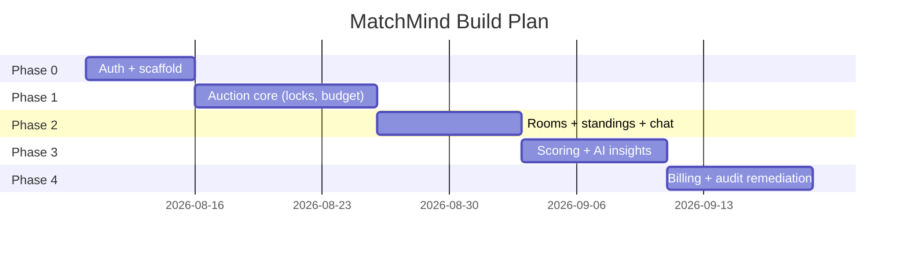
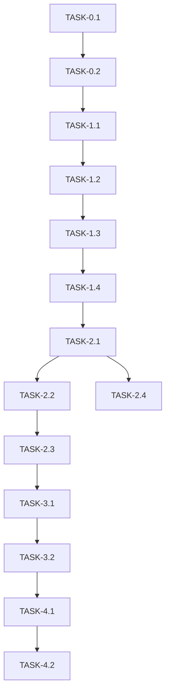

# ImplementationPlan — MatchMind: Phased Build Plan

| Field        | Value            |
| ------------ | ---------------- |
| Version      | v0.1             |
| Last Updated | 2026-08-06       |
| Owner        | Engineering Lead |
| Status       | In Review        |

---

## 1. Build Philosophy

Auction-first: get the real-time bid loop working with integrity (locks, budget, anti-snipe), then layer rooms, standings, chat, scoring, AI, and billing. Audit-driven remediation happens continuously (4.8 → 6.2/10 so far).

## 2. Phase Overview

## 3. Phase Breakdown

### Phase 0: Auth

- Goal: JWT + refresh + OAuth.
- Exit: auth tests green.

| TASK-#   | Description                  | Depends on | Owner | Est. | Maps to |
| -------- | ---------------------------- | ---------- | ----- | ---- | ------- |
| TASK-0.1 | Backend scaffold + Zod + env | —          | Eng   | 3d   | REQ-001 |
| TASK-0.2 | JWT + refresh + Google OAuth | TASK-0.1   | Eng   | 3d   | US-001  |

### Phase 1: Auction Core

- Goal: conflict-free bidding with budget.
- Exit: concurrency tests pass.

| TASK-#   | Description                            | Depends on | Owner | Est. | Maps to          |
| -------- | -------------------------------------- | ---------- | ----- | ---- | ---------------- |
| TASK-1.1 | Socket.IO server + events              | TASK-0.2   | Eng   | 4d   | REQ-001          |
| TASK-1.2 | Redis locks + bid service              | TASK-1.1   | Eng   | 4d   | REQ-001, TBL-bid |
| TASK-1.3 | Budget lockout + anti-snipe            | TASK-1.2   | Eng   | 3d   | REQ-002, REQ-004 |
| TASK-1.4 | Dynamic increments + blind nominations | TASK-1.3   | Eng   | 3d   | REQ-003, REQ-012 |

### Phase 2: Rooms & Social

- Goal: rooms, standings, chat.
- Exit: room flows work.

| TASK-#   | Description                    | Depends on | Owner | Est. | Maps to          |
| -------- | ------------------------------ | ---------- | ----- | ---- | ---------------- |
| TASK-2.1 | Rooms CRUD + join              | TASK-1.4   | Eng   | 3d   | US-008           |
| TASK-2.2 | Squad + roster enforcement     | TASK-2.1   | Eng   | 3d   | REQ-005          |
| TASK-2.3 | Standings + global leaderboard | TASK-2.2   | Eng   | 3d   | REQ-006, REQ-007 |
| TASK-2.4 | Real-time chat                 | TASK-2.1   | Eng   | 2d   | REQ-008          |

### Phase 3: Scoring + AI

- Goal: fantasy points + Claude insights.
- Exit: scoring + insights live.

| TASK-#   | Description                | Depends on | Owner | Est. | Maps to |
| -------- | -------------------------- | ---------- | ----- | ---- | ------- |
| TASK-3.1 | Scoring engine + ledger    | TASK-2.3   | Eng   | 4d   | REQ-009 |
| TASK-3.2 | AI draft insights (Claude) | TASK-3.1   | Eng   | 3d   | REQ-010 |

### Phase 4: Billing + Remediation

- Goal: Stripe pro + audit fixes.
- Exit: audit score improved, billing works.

| TASK-#   | Description                       | Depends on | Owner | Est. | Maps to |
| -------- | --------------------------------- | ---------- | ----- | ---- | ------- |
| TASK-4.1 | Stripe checkout + webhooks        | TASK-3.2   | Eng   | 4d   | REQ-011 |
| TASK-4.2 | Audit remediation (N+1, security) | TASK-4.1   | Eng   | 4d   | US-002  |

## 4. Dependency Graph

## 5. Environment & Tooling Setup Checklist

- [ ] Node 20+ + npm install (frontend/backend)
- [ ] PostgreSQL + Redis running
- [ ] `.env` with JWT secrets, Stripe key, Claude key
- [ ] `npm test` (Vitest) green
- [ ] Lint/typecheck/gitleaks CI green

## 6. Rollout Strategy

- Feature flags for AI insights + pro billing.
- Canary: private rooms first.
- Rollback: image revert; scoring worker pinned.

## 7. Definition of Done (global)

- [ ] Tests pass (Vitest)
- [ ] Docs updated (this suite)
- [ ] Reviewed
- [ ] Gitleaks clean; CSRF + revocation verified
- [ ] Lighthouse ≥ 90/95

## 8. Related Documents

| Document                                                          | Relationship |
| ----------------------------------------------------------------- | ------------ |
| [PRD.md](../product/PRD.md)                                       | REQ mapping  |
| [TechSpec.md](../technical/TechSpec.md)                           | Components   |
| [AppFlow.md](../design/AppFlow.md)                                | Flows        |
| [Schema.md](../technical/Schema.md)                               | Data         |
| [Design.md](../design/Design.md)                                  | UI tasks     |
| [Tracker.md](Tracker.md)                                          | Status       |
| [Rules.md](Rules.md)                                              | Standards    |
| [API.md](../technical/API.md)                                     | Contract     |
| [SecurityAndCompliance.md](../technical/SecurityAndCompliance.md) | Security     |
| [Testing.md](../technical/Testing.md)                             | Tests        |
| [Deployment.md](../technical/Deployment.md)                       | Rollout      |
| [Glossary.md](../reference/Glossary.md)                           | Vocabulary   |
| [RiskRegister.md](RiskRegister.md)                                | Risks        |
