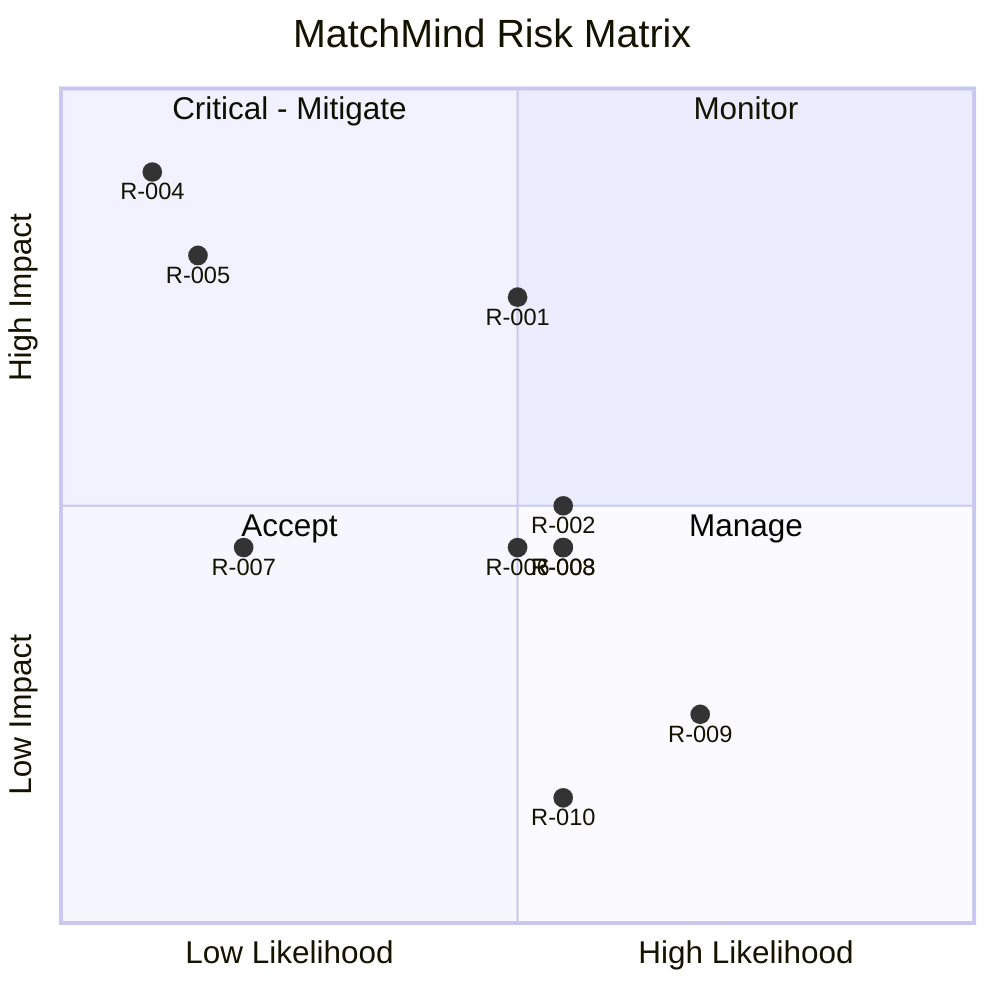

# RiskRegister — MatchMind: Known Risks

| Field        | Value         |
| ------------ | ------------- |
| Version      | v0.1          |
| Last Updated | 2026-08-06    |
| Owner        | PM / Eng Lead |
| Status       | In Review     |

---

| Risk                                  | Likelihood | Impact   | Score | Mitigation                               | Owner    | Status                  |
| ------------------------------------- | ---------- | -------- | ----- | ---------------------------------------- | -------- | ----------------------- |
| R-001 WS race conditions              | Medium     | High     | 6     | Redis distributed locks                  | Eng      | Mitigating              |
| R-002 WS horizontal scaling           | Medium     | Medium   | 4     | socket.io-redis-adapter (roadmap)        | Eng      | Open                    |
| R-003 N+1 queries                     | Medium     | Medium   | 4     | Repository patterns (fixed in audit)     | Eng      | Mitigating              |
| R-004 JWT compromise                  | Low        | Critical | 8     | Rotation + revocation + separate secrets | Security | Mitigating              |
| R-005 CSRF forgery                    | Low        | High     | 5     | CSRF tokens + tests                      | Security | Mitigating              |
| R-006 Redis outage                    | Medium     | Medium   | 4     | BullMQ sync fallback                     | DevOps   | Mitigating              |
| R-007 Stripe webhook failure          | Low        | Medium   | 3     | Signature verify + retry                 | Eng      | Open                    |
| R-008 Event-loop blocking (scoring)   | Medium     | Medium   | 4     | Worker extraction (roadmap)              | Eng      | Open                    |
| R-009 Test artifact collection errors | High       | Low      | 3     | Move/ignore test-output files            | QA       | 🟢 Resolved (v5.0 pass) |
| R-010 AI insight cost                 | Medium     | Low      | 2     | Deterministic fallback                   | PM       | Accepted                |

## Risk Matrix

## Related Documents

| Document                                                          | Relationship  |
| ----------------------------------------------------------------- | ------------- |
| [PRD.md](../product/PRD.md)                                       | Top-3 risks   |
| [SecurityAndCompliance.md](../technical/SecurityAndCompliance.md) | R-004/005     |
| [TechSpec.md](../technical/TechSpec.md)                           | R-001/002/008 |
| [AppFlow.md](../design/AppFlow.md)                                | Flows         |
| [Design.md](../design/Design.md)                                  | Design        |
| [Schema.md](../technical/Schema.md)                               | Data          |
| [ImplementationPlan.md](ImplementationPlan.md)                    | Mitigations   |
| [Tracker.md](Tracker.md)                                          | BLK-001       |
| [Rules.md](Rules.md)                                              | Standards     |
| [API.md](../technical/API.md)                                     | R-007         |
| [Testing.md](../technical/Testing.md)                             | Test coverage |
| [Deployment.md](../technical/Deployment.md)                       | Rollback      |
| [Glossary.md](../reference/Glossary.md)                           | Vocabulary    |
