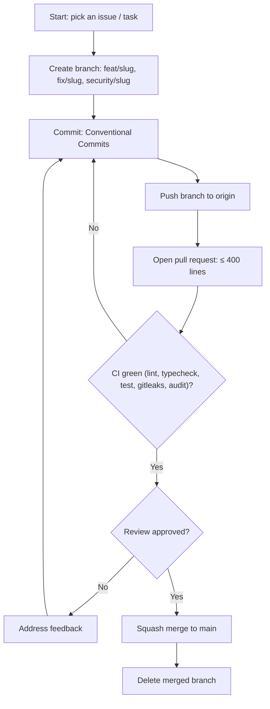

# Rules — MatchMind: Coding Standards & AI-Agent Operating Rules

| Field        | Value            |
| ------------ | ---------------- |
| Version      | v0.1             |
| Last Updated | 2026-08-06       |
| Owner        | Engineering Lead |
| Status       | In Review        |

---

## 1. Guiding Principles

1. TypeScript strict everywhere — no `any`.
2. Readability over cleverness.
3. No silent failures — every error surfaces to UI or logs.
4. Small PRs only.
5. Tests accompany behavior changes (Vitest).
6. Repository pattern for all data access.
7. Security boundaries: CSRF, token revocation, separated JWT secrets.

## 2. Code Style

- TypeScript strict mode; ESLint + Prettier.
- Structure:

```
frontend/            # React 19 SPA (views, store, socket client)
backend/
  src/
    routes/          # Zod-validated API routes
    services/        # auth, scoring, draft
    repositories/    # data access
    sockets/         # Socket.IO server
    jobs/            # BullMQ workers
tests/
```

## 3. Git Workflow

- Branches: `feat/<slug>`, `fix/<slug>`, `security/<slug>`.
- Commits: Conventional Commits.
- PRs: ≤ 400 lines; CI green (lint, typecheck, test, gitleaks, audit).
- Merge: squash to main.

## 4. Testing Requirements

- 194 Vitest tests; coverage ≥ 70%.
- MUST have tests: bid race conditions, budget lockout, anti-snipe, auth/token revocation, scoring.
- See [Testing.md](../technical/Testing.md).

## 5. AI Agent Operating Rules

- Always read Tracker.md and ImplementationPlan.md before starting.
- Never mark a task 🟢 Done without tests passing.
- Never invent requirements not in ../product/PRD.md/../technical/TechSpec.md — flag ambiguity.
- Always update ../technical/Schema.md when migrations change.
- Never commit secrets; env vars per ../technical/SecurityAndCompliance.md.
- Cross-check ../design/Design.md before building UI.
- State conflicts rather than silently picking one.

## 6. Security Baseline Rules

- Helmet, CORS, CSRF tokens, rate limiting.
- JWT access + refresh with revocation; separated secrets.
- Gitleaks in CI.
- Zod validation on every input.
- Dependency scans (Dependabot).

## 7. Documentation Rules

- Endpoint changes → ../technical/API.md same PR.
- Schema changes → ../technical/Schema.md same PR.
- New env vars → ../technical/Deployment.md.

## 8. Prohibited Patterns

| Anti-pattern                       | Why           |
| ---------------------------------- | ------------- |
| `any` in TS                        | Type unsafety |
| N+1 queries                        | Perf          |
| Direct JSON DB writes in prod code | Data loss     |
| localStorage for tokens            | XSS           |
| Unbounded socket events            | Memory/DoS    |

## 9. Escalation Rules

**Ask a human when:** schema migrations, Stripe changes, security incidents, WS scaling decisions.
**Decide autonomously:** refactors, tests, UI polish, config.

## Git / PR Workflow



## 10. Related Documents

| Document                                                          | Relationship      |
| ----------------------------------------------------------------- | ----------------- |
| [Testing.md](../technical/Testing.md)                             | Test requirements |
| [SecurityAndCompliance.md](../technical/SecurityAndCompliance.md) | Security          |
| [PRD.md](../product/PRD.md)                                       | Requirements      |
| [TechSpec.md](../technical/TechSpec.md)                           | Architecture      |
| [AppFlow.md](../design/AppFlow.md)                                | Flows             |
| [Design.md](../design/Design.md)                                  | Design            |
| [Schema.md](../technical/Schema.md)                               | Data              |
| [ImplementationPlan.md](ImplementationPlan.md)                    | Tasks             |
| [Tracker.md](Tracker.md)                                          | Status            |
| [API.md](../technical/API.md)                                     | Contract          |
| [Deployment.md](../technical/Deployment.md)                       | Env vars          |
| [Glossary.md](../reference/Glossary.md)                           | Vocabulary        |
| [RiskRegister.md](RiskRegister.md)                                | Risks             |
