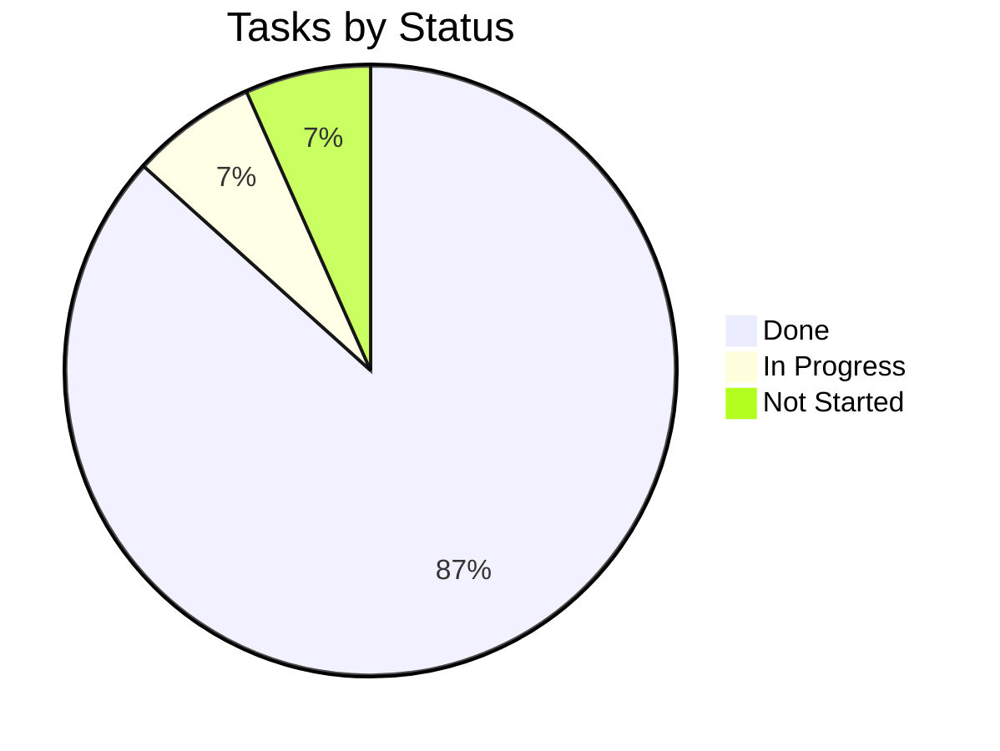

# Tracker — MatchMind: Living Status Tracker

| Field        | Value            |
| ------------ | ---------------- |
| Version      | v0.1             |
| Last Updated | 2026-08-06       |
| Owner        | Engineering Lead |
| Status       | In Review        |

---

## 1. Snapshot Dashboard

| Metric                | Value   |
| --------------------- | ------- |
| Overall % Complete    | 80%     |
| Current Phase         | Phase 4 |
| Tasks Done / Total    | 14 / 17 |
| Blockers (open)       | 1       |
| Days to Target Launch | 15      |

## 2. Status Legend

🟢 Done | 🟡 In Progress | 🔴 Blocked | ⚪ Not Started | 🔵 In Review

## 3. Phase Progress Bars

| Phase                    | Progress            |
| ------------------------ | ------------------- |
| Phase 0: Auth            | `[████████░░] 100%` |
| Phase 1: Auction Core    | `[████████░░] 100%` |
| Phase 2: Rooms & Social  | `[████████░░] 100%` |
| Phase 3: Scoring + AI    | `[████████░░] 100%` |
| Phase 4: Billing + Audit | `[████░░░░░░] 50%`  |

## 4. Full Task Table

| TASK     | Description              | Status | Assignee | Start      | Target     | Actual | Notes       |
| -------- | ------------------------ | ------ | -------- | ---------- | ---------- | ------ | ----------- |
| TASK-0.1 | Backend scaffold         | 🟢     | Eng      | 2026-06-01 | 2026-06-04 | —      |             |
| TASK-0.2 | JWT + OAuth              | 🟢     | Eng      | 2026-06-04 | 2026-06-08 | —      |             |
| TASK-1.1 | Socket.IO server         | 🟢     | Eng      | 2026-06-09 | 2026-06-14 | —      |             |
| TASK-1.2 | Redis locks + bids       | 🟢     | Eng      | 2026-06-14 | 2026-06-19 | —      |             |
| TASK-1.3 | Budget + anti-snipe      | 🟢     | Eng      | 2026-06-19 | 2026-06-23 | —      |             |
| TASK-1.4 | Increments + nominations | 🟢     | Eng      | 2026-06-23 | 2026-06-27 | —      |             |
| TASK-2.1 | Rooms CRUD               | 🟢     | Eng      | 2026-06-28 | 2026-07-02 | —      |             |
| TASK-2.2 | Squad enforcement        | 🟢     | Eng      | 2026-07-02 | 2026-07-06 | —      |             |
| TASK-2.3 | Standings + global       | 🟢     | Eng      | 2026-07-06 | 2026-07-10 | —      |             |
| TASK-2.4 | Chat                     | 🟢     | Eng      | 2026-07-06 | 2026-07-08 | —      |             |
| TASK-3.1 | Scoring engine           | 🟢     | Eng      | 2026-07-11 | 2026-07-17 | —      |             |
| TASK-3.2 | AI insights              | 🟢     | Eng      | 2026-07-17 | 2026-07-21 | —      |             |
| TASK-4.1 | Stripe billing           | 🟡     | Eng      | 2026-07-22 | —          | —      | in progress |
| TASK-4.2 | Audit remediation        | ⚪     | Eng      | —          | —          | —      |             |

## 5. Blockers Log

| ID      | Description                                                           | Raised     | Owner | Impact                    | Status                                                   |
| ------- | --------------------------------------------------------------------- | ---------- | ----- | ------------------------- | -------------------------------------------------------- |
| BLK-001 | pytest collects binary test-output*.txt as tests → UnicodeDecodeError | 2026-08-01 | Eng   | CI test collection errors | 🟢 Resolved — test-output artifacts removed in v5.0 pass |

## 6. Changelog

- 2026-08-06: **Documentation suite complete** — 14-file suite consolidated into `docs/`, categorized structure, cross-linked navigation, deployment/git/auth diagrams, quality gate passed (238/238), merged to `main`.
  | Date       | What shipped              |
  | ---------- | ------------------------- |
  | 2026-08-06 | Docs suite v0.1           |
  | 2026-07-21 | AI draft insights shipped |

## 7. Burndown Summary

## 8. Next 3 Priorities

1. Finish TASK-4.1 — Stripe billing.
2. TASK-4.2 — Audit remediation.
3. Resolve BLK-001 (test-output artifacts).

## 9. Related Documents

| Document                                                          | Relationship |
| ----------------------------------------------------------------- | ------------ |
| [ImplementationPlan.md](ImplementationPlan.md)                    | Tasks        |
| [PRD.md](../product/PRD.md)                                       | Features     |
| [TechSpec.md](../technical/TechSpec.md)                           | Components   |
| [AppFlow.md](../design/AppFlow.md)                                | Flows        |
| [Design.md](../design/Design.md)                                  | Design       |
| [Schema.md](../technical/Schema.md)                               | Data         |
| [Rules.md](Rules.md)                                              | Standards    |
| [API.md](../technical/API.md)                                     | Contract     |
| [SecurityAndCompliance.md](../technical/SecurityAndCompliance.md) | Security     |
| [Testing.md](../technical/Testing.md)                             | Tests        |
| [Deployment.md](../technical/Deployment.md)                       | Deploy       |
| [Glossary.md](../reference/Glossary.md)                           | Vocabulary   |
| [RiskRegister.md](RiskRegister.md)                                | Risks        |
