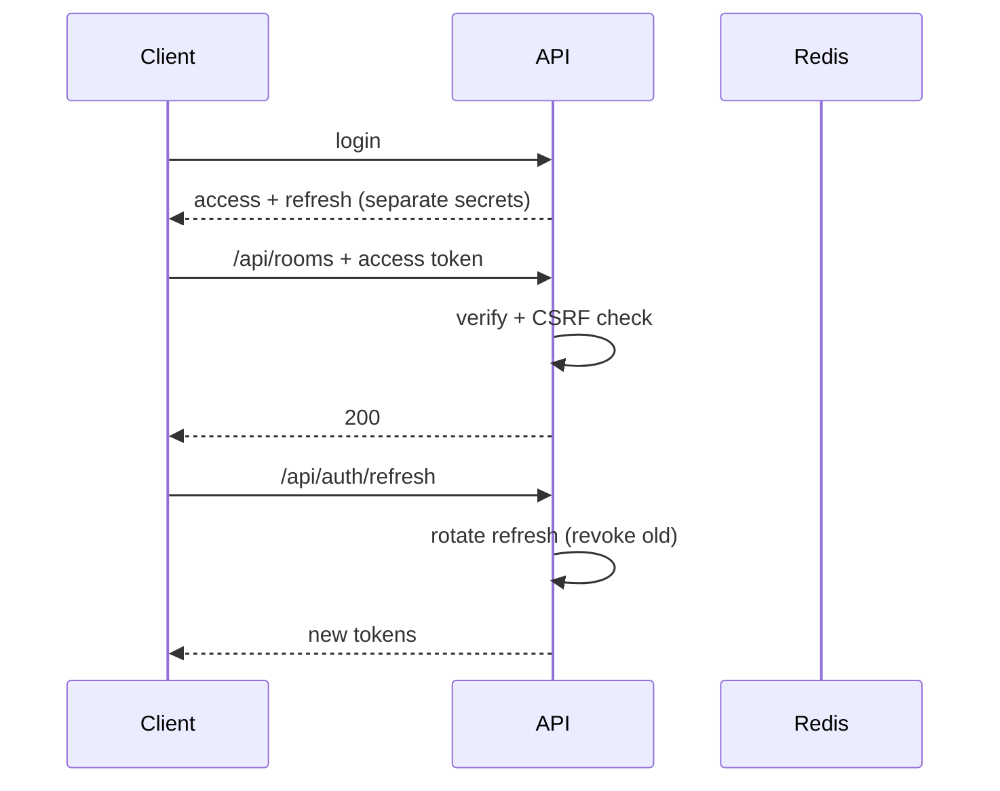

# API — MatchMind: API Reference

| Field        | Value            |
| ------------ | ---------------- |
| Version      | v0.1             |
| Last Updated | 2026-08-06       |
| Owner        | Backend Engineer |
| Status       | In Review        |

---

> 45+ REST endpoints + Socket.IO event surface. Representative subset; OpenAPI/type schemas authoritative.

## 1. Endpoint Inventory (representative)

| Method | Path                        | Auth | Description           |
| ------ | --------------------------- | ---- | --------------------- |
| POST   | `/api/auth/register`        | No   | Register              |
| POST   | `/api/auth/login`           | No   | Login (JWT + refresh) |
| POST   | `/api/auth/google`          | No   | Google OAuth          |
| POST   | `/api/auth/refresh`         | Yes  | Refresh rotation      |
| POST   | `/api/auth/logout`          | Yes  | Revoke                |
| GET    | `/api/rooms`                | Yes  | List rooms            |
| POST   | `/api/rooms`                | Yes  | Create room           |
| GET    | `/api/rooms/:id`            | Yes  | Room detail           |
| POST   | `/api/rooms/:id/join`       | Yes  | Join room             |
| GET    | `/api/players`              | Yes  | Player pool           |
| GET    | `/api/rooms/:id/standings`  | Yes  | Room standings        |
| GET    | `/api/leaderboard/global`   | Yes  | Global standings      |
| POST   | `/api/billing/checkout`     | Yes  | Stripe checkout       |
| GET    | `/api/billing/subscription` | Yes  | Subscription status   |

## 2. Socket.IO Events

| Event                | Direction       | Description          |
| -------------------- | --------------- | -------------------- |
| `auction:bid`        | client → server | Place bid            |
| `auction:state`      | server → all    | Auction state update |
| `auction:nomination` | server → all    | New player nominated |
| `chat:message`       | both            | Chat message         |
| `room:standings`     | server → all    | Standings update     |
| `draft:complete`     | server → all    | Draft finished       |

## 3. Example: POST /api/auth/login

Request: `{"email": "...", "password": "..."}`
Response: `{"access_token": "...", "refresh_token": "..."}`

## 4. Error Codes

| Code | Meaning         | Retry?   |
| ---- | --------------- | -------- |
| 400  | Bad request     | No       |
| 401  | Unauthenticated | Re-login |
| 403  | Forbidden       | No       |
| 404  | Not found       | No       |
| 422  | Zod validation  | No       |
| 429  | Rate limited    | Yes      |

## 5. Auth Flow

## 6. Versioning Policy

- `/api/` v1; breaking changes gated behind `/api/v2/`.

## 7. Related Documents

| Document                                                  | Relationship   |
| --------------------------------------------------------- | -------------- |
| [TechSpec.md](TechSpec.md)                                | API layer      |
| [Schema.md](Schema.md)                                    | Tables         |
| [SecurityAndCompliance.md](SecurityAndCompliance.md)      | Auth           |
| [AppFlow.md](../design/AppFlow.md)                        | Flows          |
| [PRD.md](../product/PRD.md)                               | Requirements   |
| [Design.md](../design/Design.md)                          | Rendering      |
| [ImplementationPlan.md](../project/ImplementationPlan.md) | Tasks          |
| [Tracker.md](../project/Tracker.md)                       | Status         |
| [Rules.md](../project/Rules.md)                           | Standards      |
| [Testing.md](Testing.md)                                  | Contract tests |
| [Deployment.md](Deployment.md)                            | Deploy         |
| [Glossary.md](../reference/Glossary.md)                   | Vocabulary     |
| [RiskRegister.md](../project/RiskRegister.md)             | Risks          |
