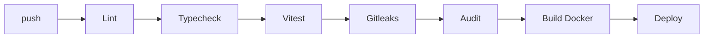

# Deployment — MatchMind: Environments, CI/CD, Rollback

| Field        | Value           |
| ------------ | --------------- |
| Version      | v0.1            |
| Last Updated | 2026-08-06      |
| Owner        | DevOps Engineer |
| Status       | In Review       |

---

## 1. Service Topology

| Service  | Purpose             | Port                |
| -------- | ------------------- | ------------------- |
| web      | React SPA (static)  | 5173 dev / CDN prod |
| api      | Express + Socket.IO | 3000                |
| worker   | BullMQ worker       | —                   |
| postgres | PG16                | 5432                |
| redis    | locks/cache/jobs    | 6379                |

## 2. CI/CD Pipeline

## 3. Environment Promotion

| Step | From    | To      | Trigger         |
| ---- | ------- | ------- | --------------- |
| 1    | main    | staging | CI green        |
| 2    | staging | prod    | manual approval |

## 4. Rollback Procedure

- Image revert; WebSocket adapter rollout as separate step.
- Stripe webhook verification ensures billing consistency.

## 5. Feature Flags

- `AI_INSIGHTS_ENABLED`, `PRO_BILLING_ENABLED`, `SCORING_WORKER_ENABLED`.

## 6. On-Call / Runbook

- **Bids lagging:** check WS node + Redis locks.
- **Leaderboard stale:** Redis cache TTL/invalidate.
- **Chat broken:** WS reconnect + state resync.
- **Stripe webhooks failing:** verify endpoint secret.

## 7. Related Documents

| Document                                                  | Relationship     |
| --------------------------------------------------------- | ---------------- |
| [TechSpec.md](TechSpec.md)                                | Environments     |
| [SecurityAndCompliance.md](SecurityAndCompliance.md)      | Secrets          |
| [PRD.md](../product/PRD.md)                               | Release criteria |
| [AppFlow.md](../design/AppFlow.md)                        | Flows            |
| [Schema.md](Schema.md)                                    | Migrations       |
| [Design.md](../design/Design.md)                          | Design           |
| [ImplementationPlan.md](../project/ImplementationPlan.md) | Rollout          |
| [Tracker.md](../project/Tracker.md)                       | Status           |
| [Rules.md](../project/Rules.md)                           | Standards        |
| [API.md](API.md)                                          | Endpoints        |
| [Testing.md](Testing.md)                                  | CI gates         |
| [Glossary.md](../reference/Glossary.md)                   | Vocabulary       |
| [RiskRegister.md](../project/RiskRegister.md)             | Risks            |
