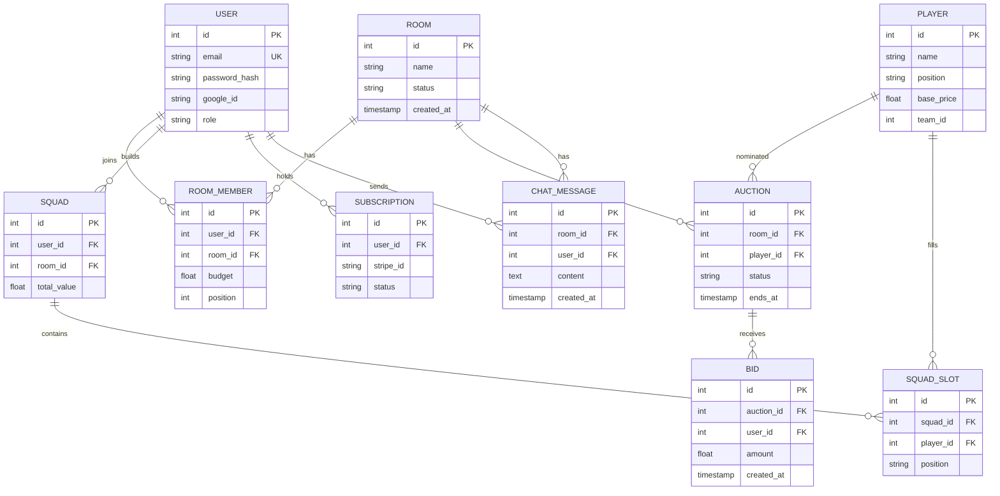

# Schema — MatchMind: Data Model

| Field        | Value         |
| ------------ | ------------- |
| Version      | v0.1          |
| Last Updated | 2026-08-06    |
| Owner        | Data Engineer |
| Status       | In Review     |

---

> Postgres-backed (migrated from JSON DB via a Prisma-like proxy layer). Representative subset.

## 1. ER Diagram



## 2. Table/Collection Definitions

### TBL-room

| Field      | Type      | Nullable | Default | Constraints                      | Description |
| ---------- | --------- | -------- | ------- | -------------------------------- | ----------- |
| id         | int PK    | No       | auto    | —                                | PK          |
| name       | string    | No       | —       | —                                | room name   |
| status     | enum      | No       | pending | pending/active/drafting/complete | state       |
| created_at | timestamp | No       | now()   | —                                | when        |

### TBL-bid

| Field      | Type      | Nullable | Default | Constraints   | Description |
| ---------- | --------- | -------- | ------- | ------------- | ----------- |
| id         | int PK    | No       | auto    | —             | PK          |
| auction_id | int FK    | No       | —       | → auction     | parent      |
| user_id    | int FK    | No       | —       | → user        | bidder      |
| amount     | float     | No       | —       | > 0, ≤ budget | bid value   |
| created_at | timestamp | No       | now()   | —             | when        |

### TBL-squad_slot

| Field     | Type   | Nullable | Default | Constraints    | Description |
| --------- | ------ | -------- | ------- | -------------- | ----------- |
| id        | int PK | No       | auto    | —              | PK          |
| squad_id  | int FK | No       | —       | → squad        | parent      |
| player_id | int FK | No       | —       | → player       | player      |
| position  | enum   | No       | —       | GK/DEF/MID/FWD | slot        |

## 3. Relationships & Foreign Keys

| Table A      | Table B | On delete | Justification        |
| ------------ | ------- | --------- | -------------------- |
| bid          | auction | cascade   | bids follow auction  |
| room_member  | room    | cascade   | membership follows   |
| squad_slot   | squad   | cascade   | slots follow squad   |
| chat_message | room    | cascade   | messages follow room |

## 4. Indexes

| Table        | Index                | Columns                  | Type  | Reason       |
| ------------ | -------------------- | ------------------------ | ----- | ------------ |
| bid          | idx_bid_auction_time | (auction_id, created_at) | btree | bid history  |
| room_member  | idx_member_room      | (room_id)                | btree | roster       |
| squad_slot   | idx_slot_squad       | (squad_id)               | btree | squad view   |
| chat_message | idx_msg_room_time    | (room_id, created_at)    | btree | chat history |

## 5. Enums / Constants

| Enum                | Allowed values                      |
| ------------------- | ----------------------------------- |
| room.status         | pending, active, drafting, complete |
| position            | GK, DEF, MID, FWD                   |
| salary cap          | $100M                               |
| squad size          | 15 (2 GK, 5 DEF, 5 MID, 3 FWD)      |
| subscription.status | active, canceled, past_due          |

## 6. Data Lifecycle

- Rooms archived after draft completion.
- Chat retained per room for history.
- Subscriptions via Stripe webhooks.

## 7. Migrations Strategy

- Tool: Prisma-style migrations (proxy layer) / SQL.
- Rollback: migration revert + reseed.

## 8. Sample Records

```json
{
  "room": { "id": 1, "name": "Weekend Draft", "status": "drafting" },
  "bid": { "auction_id": 3, "user_id": 7, "amount": 18500000 },
  "squad_slot": { "squad_id": 2, "player_id": 11, "position": "FWD" }
}
```

## 9. Data Validation Rules

| Field               | DB constraint   | App layer                  |
| ------------------- | --------------- | -------------------------- |
| bid.amount          | > 0             | Zod + service budget check |
| bid.amount ≤ budget | service lockout | auction service            |
| squad size = 15     | service         | draft service              |
| position counts     | 2/5/5/3         | draft service              |

## 10. Sensitive Data Map

| Field         | Sensitivity | Encrypted at rest? | Masked in logs?     |
| ------------- | ----------- | ------------------ | ------------------- |
| password_hash | credential  | bcrypt             | never logged        |
| email         | PII         | —                  | masked              |
| stripe_id     | financial   | —                  | access-controlled   |
| JWT refresh   | auth        | —                  | revoked on rotation |

## 11. Related Documents

| Document                                                  | Relationship              |
| --------------------------------------------------------- | ------------------------- |
| [API.md](API.md)                                          | Endpoints touching tables |
| [TechSpec.md](TechSpec.md)                                | Repositories              |
| [PRD.md](../product/PRD.md)                               | Requirements              |
| [AppFlow.md](../design/AppFlow.md)                        | Flows                     |
| [Design.md](../design/Design.md)                          | Display data              |
| [ImplementationPlan.md](../project/ImplementationPlan.md) | Tasks                     |
| [Tracker.md](../project/Tracker.md)                       | Status                    |
| [Rules.md](../project/Rules.md)                           | Standards                 |
| [SecurityAndCompliance.md](SecurityAndCompliance.md)      | Sensitive map             |
| [Testing.md](Testing.md)                                  | Data tests                |
| [Deployment.md](Deployment.md)                            | Migrations                |
| [Glossary.md](../reference/Glossary.md)                   | Vocabulary                |
| [RiskRegister.md](../project/RiskRegister.md)             | Risks                     |
