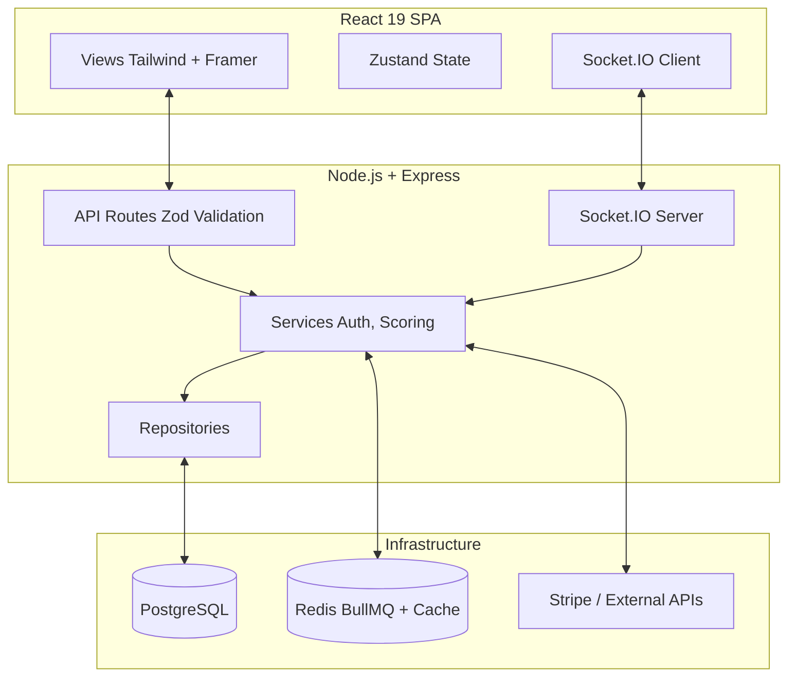
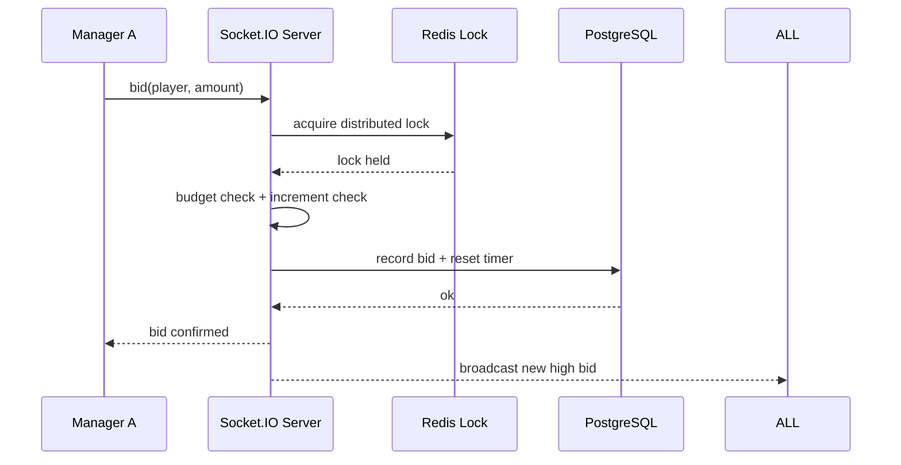
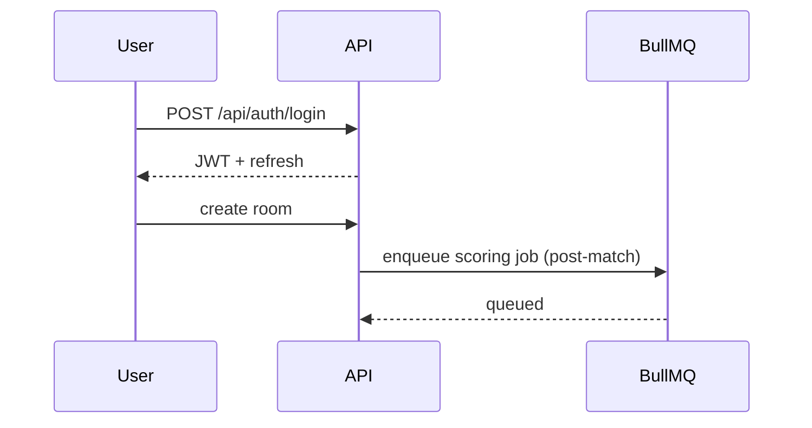
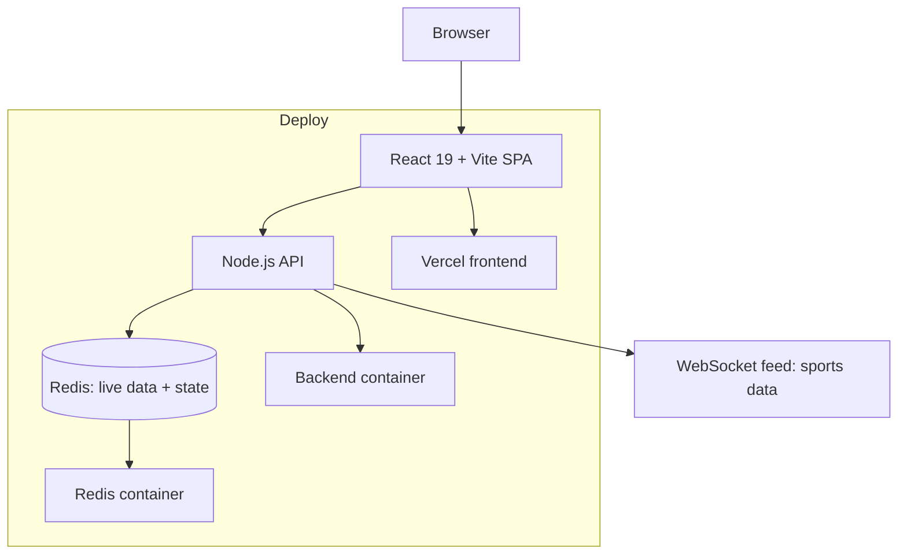

# TechSpec — MatchMind: Technical Specification

| Field        | Value            |
| ------------ | ---------------- |
| Version      | v0.1             |
| Last Updated | 2026-08-06       |
| Owner        | Engineering Lead |
| Status       | In Review        |

---

## 1. Architecture Overview

## 2. Tech Stack Table

| Layer      | Technology                                | Version | Justification          |
| ---------- | ----------------------------------------- | ------- | ---------------------- |
| Language   | TypeScript (strict)                       | 6.x     | 100% typed             |
| Frontend   | React 19 + Vite                           | 19 / 6  | Fast SPA               |
| State      | Zustand                                   | —       | Lightweight            |
| Styling    | Tailwind + Framer Motion                  | —       | Terminal aesthetic     |
| Backend    | Node.js + Express                         | 20+ / 5 | Mature REST            |
| Realtime   | Socket.IO                                 | —       | Low-latency events     |
| Validation | Zod                                       | —       | Runtime schemas        |
| DB         | PostgreSQL                                | 16      | ACID                   |
| Cache/Jobs | Redis + BullMQ                            | 7       | Locks + queues + cache |
| Billing    | Stripe                                    | —       | Subscriptions          |
| AI         | Anthropic Claude                          | —       | Draft insights         |
| Testing    | Vitest                                    | —       | 194 tests              |
| Security   | Helmet, CORS, CSRF, rate limits, gitleaks | —       | hardened               |

## 3. System Components

| Component        | Responsibility             | Inputs → Outputs      | Scaling        | Failure Modes              |
| ---------------- | -------------------------- | --------------------- | -------------- | -------------------------- |
| React SPA        | UI (36 views)              | user → API/WS         | static + API   | API down                   |
| Express API      | REST (45+ endpoints)       | request → response    | horizontal     | auth errors                |
| Services         | Auth, scoring, draft logic | args → result         | in-process     | domain errors              |
| Repositories     | Data access                | ORM → rows            | —              | DB down                    |
| Socket.IO server | Live events                | events → clients      | single node v1 | multi-node needs adapter   |
| BullMQ           | Background jobs            | jobs → effects        | add workers    | Redis down → sync fallback |
| Scoring engine   | Fantasy points             | performances → points | in-process     | event-loop block at scale  |

## 4. Data Flow Diagrams

## 5. Third-Party Integrations

| Service          | Purpose          | Failure Fallback       | Cost Model      | Rate Limits |
| ---------------- | ---------------- | ---------------------- | --------------- | ----------- |
| Stripe           | Pro billing      | manual support         | per-transaction | —           |
| Anthropic Claude | Draft insights   | deterministic fallback | token           | quota       |
| Redis            | Locks/cache/jobs | sync direct-mode       | self-hosted     | —           |

## 6. Non-Functional Requirements

| Category      | Requirement                                   | Target             | How Verified |
| ------------- | --------------------------------------------- | ------------------ | ------------ |
| Performance   | Lighthouse                                    | 98 perf / 100 a11y | audits       |
| Concurrency   | Auction race safety                           | 0 conflicts        | tests        |
| Availability  | Chat + bids real-time                         | < 200ms p95        | metrics      |
| Security      | CSRF, token revocation, separated JWT secrets | enforced           | tests        |
| Observability | Logs + metrics                                | all endpoints      | tooling      |

## 7. Environments

| Env     | URL                 | Data           | Deploy  |
| ------- | ------------------- | -------------- | ------- |
| dev     | localhost:5173/3000 | seeded JSON→PG | manual  |
| staging | staging             | sample         | CI      |
| prod    | prod                | real           | release |

## 8. Error Handling Strategy

- Zod validation → 422 with details.
- Redis down → BullMQ sync fallback.
- Auth: JWT access + refresh, CSRF tokens, rate limiting.
- Scoped errors per domain with consistent envelope.

## 9. Observability

- Structured logs, request IDs.
- Redis cache hit ratio for leaderboards.
- CI: lint, typecheck, test, gitleaks, audit.

## 10. Technical Risks & Mitigations

| Risk                  | Mitigation                              |
| --------------------- | --------------------------------------- |
| WS race conditions    | Redis distributed locks                 |
| WS horizontal scaling | socket.io-redis-adapter (roadmap)       |
| N+1 queries           | Repository patterns (audit remediation) |
| Event-loop blocking   | Scoring worker extraction (roadmap)     |

## Deployment Topology

## 11. Related Documents

| Document                                                  | Relationship |
| --------------------------------------------------------- | ------------ |
| [PRD.md](../product/PRD.md)                               | Requirements |
| [Schema.md](Schema.md)                                    | Data model   |
| [API.md](API.md)                                          | Endpoints    |
| [AppFlow.md](../design/AppFlow.md)                        | Flows        |
| [Design.md](../design/Design.md)                          | UI           |
| [ImplementationPlan.md](../project/ImplementationPlan.md) | Phases       |
| [Tracker.md](../project/Tracker.md)                       | Status       |
| [Rules.md](../project/Rules.md)                           | Standards    |
| [SecurityAndCompliance.md](SecurityAndCompliance.md)      | Security     |
| [Testing.md](Testing.md)                                  | Tests        |
| [Deployment.md](Deployment.md)                            | Deployment   |
| [Glossary.md](../reference/Glossary.md)                   | Vocabulary   |
| [RiskRegister.md](../project/RiskRegister.md)             | Risks        |
