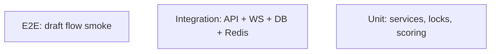

# Testing — MatchMind: Test Strategy

| Field        | Value       |
| ------------ | ----------- |
| Version      | v0.1        |
| Last Updated | 2026-08-06  |
| Owner        | QA Engineer |
| Status       | In Review   |

---

## 1. Test Pyramid

## 2. Strategy

| Layer       | Tool                 | Scope                              |
| ----------- | -------------------- | ---------------------------------- |
| Unit        | Vitest               | Services, scoring, increment logic |
| Integration | Vitest + test DB     | API, WS, Redis locks, budget       |
| E2E         | Playwright (roadmap) | Full draft journey                 |
| Security    | Vitest + audits      | CSRF, revocation, gitleaks         |

Current: 194 passing tests; CI includes audit.

> Note: pytest collection currently fails on binary `test-output*.txt` files in backend/tests — see ../project/Tracker.md BLK-001 (use Vitest config excludes / move artifacts).

## 3. Critical Test Cases

| ID     | Feature    | Case                            | Expected           |
| ------ | ---------- | ------------------------------- | ------------------ |
| TC-001 | Bids       | Two managers bid simultaneously | 0 conflicts (lock) |
| TC-002 | Budget     | Bid over remaining budget       | Blocked            |
| TC-003 | Anti-snipe | Late bid resets timer           | Timer reset        |
| TC-004 | Squad      | Roster 2-5-5-3 enforced         | Blocked invalid    |
| TC-005 | Auth       | Token revoked after logout      | 401                |
| TC-006 | CSRF       | State change without token      | 403                |
| TC-007 | Scoring    | Performance maps to points      | Ledger correct     |
| TC-008 | WS         | Disconnect → resync             | State consistent   |

## 4. Test Data Strategy

- Seeded players + rooms; isolated test DB; Redis test instance.

## 5. CI Gates

- `npm test` green.
- Lint + typecheck.
- Gitleaks + audit jobs.

## 6. Related Documents

| Document                                                  | Relationship      |
| --------------------------------------------------------- | ----------------- |
| [Rules.md](../project/Rules.md)                           | Test requirements |
| [PRD.md](../product/PRD.md)                               | Release criteria  |
| [TechSpec.md](TechSpec.md)                                | Components        |
| [AppFlow.md](../design/AppFlow.md)                        | Flow tests        |
| [Schema.md](Schema.md)                                    | Data tests        |
| [API.md](API.md)                                          | Contract tests    |
| [Design.md](../design/Design.md)                          | UI tests          |
| [ImplementationPlan.md](../project/ImplementationPlan.md) | Test tasks        |
| [Tracker.md](../project/Tracker.md)                       | BLK-001           |
| [SecurityAndCompliance.md](SecurityAndCompliance.md)      | Security tests    |
| [Deployment.md](Deployment.md)                            | CI gates          |
| [Glossary.md](../reference/Glossary.md)                   | Vocabulary        |
| [RiskRegister.md](../project/RiskRegister.md)             | Risks             |
